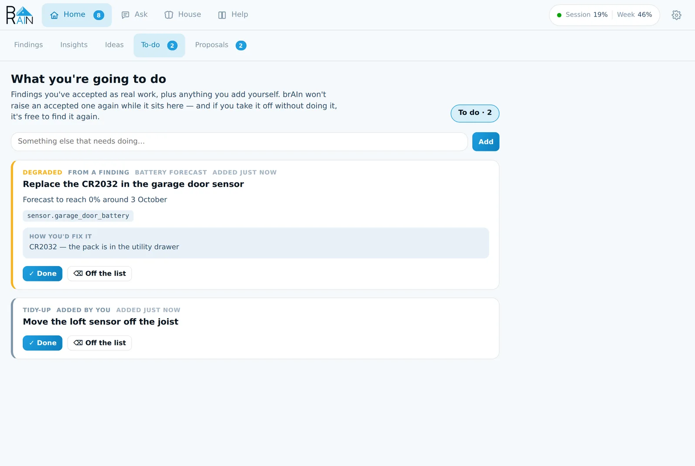

import { Steps } from '@astrojs/starlight/components';

**Home → Findings** is the list of everything brAIn wants a decision about. Mostly that's
something **broken** — a dead battery, a sensor that stopped reporting, an automation that
can never fire — but a **guess** brAIn wants confirmed and a **change** it suggests land
here too, because answering any of them is the same job.


You never have to ask for them. Findings come from brAIn's house checks (which cost no
tokens), from insight runs and study sessions, and from the **Resident** — the loop that
watches your house and decides what is worth your attention.

## What a finding looks like

These are the kinds of thing that turn up in a real house:

- **A sensor that died quietly.** *"Back door battery has reported nothing since 26 July.
  Last reading 8% at 04:11. The door sensor still reports, so this is the battery entity
  only — but your low-battery automation can no longer see it."*
- **An automation that can never fire.** *"Morning lights triggers on a motion sensor that
  was renamed three weeks ago. It has not run since."*
- **A device that came back wrong.** *"Two loft sensors have been silent since 24 July at
  14:30 — the same minute your Zigbee coordinator moved from channel 15 to 20."*
- **Tidy-up.** *"13 entities belong to devices that no longer exist."*

Every card names the thing by the name you know it by (the entity id is in a tooltip),
says how bad it is, gives a sentence or three of why, and one line of what to do — headed
**How you'd fix it** when it needs your hands, or **How brAIn would fix it** when software
can make the change. **Why brAIn thinks so**, folded under the card, shows what it actually
read, how sure it is, and what looked at the finding before you did.

:::note[The same problem is never raised twice]
Findings are deduplicated by meaning, not wording, and everything you've answered is
remembered — so a problem you've dealt with doesn't come back in new words.
:::

## One row of answers

Every problem card offers the same answers, in the same order, so you can read the row
without reading the words:

| Button | What you're saying | What happens |
| --- | --- | --- |
| **Fix it** | *brAIn, sort this out.* | Only where software can make the change. brAIn works out the exact steps and **shows them first**; nothing changes until you press **Apply**. |
| **Add to list** | *It's real and I'll get to it.* | The card moves to the **To-do** tab and brAIn stops raising it while it waits there. |
| **Dismiss** | *Not now.* | Nothing is recorded. brAIn brings it back later if it's still true — sooner the more it matters — and tells you when. |
| **Not a problem** | *You've got this wrong, or it's normal here.* | Settled for good. A box asks why (optional) — and that sentence is what brAIn learns from. |

A flat battery never offers **Fix it**, because inventing a software substitute for a dead
CR2032 is worse than saying so.

The other kinds of card use the same shape with their own words:

| Card | Its answers |
| --- | --- |
| **A guess** — *"The garage fridge is meant to run 24/7 — right?"* | **Yes · No · Dismiss** |
| **A suggestion** — a change brAIn thinks would suit your house | **Make the change · Try it for a week · Dismiss · No thanks** |
| **A plan waiting for you** | **Apply · Don't change it · Not a problem** |
| **A change brAIn made** | **Got it**, and **Undo the fix** while it can be put back |

The rarer presses live behind **⋯** on each card: *I've already fixed it*, *Check again*,
*Talk about it*, *Stop raising these*, and a few more.

## Fix it: a plan first, then your yes

<Steps>

1. **Press Fix it.** brAIn looks — read-only, it cannot change anything at this step — and
   comes back with the exact steps: which file, which entity, what it becomes, and one
   sentence on what could go wrong in *your* house.

2. **Read the plan on the card.** If it's right, press **Apply**. If not, **Don't change
   it** leaves the finding exactly as open as it was, and keeps the plan so reading it again
   costs nothing.

3. **brAIn makes the change** — exactly the steps you read. If the house has moved on or a
   step turns out to be wrong, it stops and says so rather than improvising.

4. **The card turns into a change for you to read**, with what was touched. **Got it**
   clears it; **Undo the fix** puts back every file the run edited.

</Steps>

```text title="A finding, fixed"
FINDING   Morning lights can never fire
          Its trigger references binary_sensor.hall_motion_old,
          renamed to binary_sensor.hall_motion on 8 July.

Fix it →  PLAN
          1. In automations.yaml, change the trigger of "Morning lights"
             to binary_sensor.hall_motion
          2. Validate the config and reload automations
          Risk: none — the new sensor reports the same states.

Apply →   Edited /config/automations.yaml
          Validated — OK · Reloaded automations
          Trigger now resolves

          1 file changed · Undo the fix · Got it
```

It's bounded on purpose: **one finding per run**, it **never deletes** anything it didn't
create, **never restarts** Home Assistant, **never touches** secrets or anything on your
[protected list](/brain/reference/), and **nothing runs until you press it**. Every file is
snapshotted first, so [`brain undo`](/brain/cli/) can put it back too.

## Not a problem: the answer that teaches

When a finding is wrong about your house, say so — and say why:

> *"That's a contact on a cupboard nobody opens. It's supposed to read closed."*

That sentence goes into [memory](/brain/memory/) as a correction and into every future
analysis, and on a house-check's card it tells that **rule** to stop making the same
mistake about that entity. The box is optional — "not a problem here" needs no essay — but
the reason is what stops brAIn making the same mistake in new words.

If a whole *kind* of finding is wrong for your house, **⋯ → Stop raising these** mutes that
check entirely.

## Talk about it first

**⋯ → Talk about it** opens the finding as a conversation in **Ask**, with everything brAIn
knows already in the question, and asks whether it really is a problem *here*. The
conversation changes nothing. When Claude has finished looking, it offers the ways the
finding could actually end as buttons under its answer — *"Replaced the CR2032"*, *"That
cupboard is never opened"* — and pressing one settles the finding in those words.

## The to-do list

**Home → To-do** is the work you've accepted, plus anything you add yourself.



- **✓ Done** — it's sorted. brAIn writes it into memory now (*"Replaced the garage door
  sensor battery"*), and the box asks what you did, optionally.
- **⌫ Off the list** — you're not going to do it. A chore that came from a finding is then
  free to be reported again if it's still true.

The same list appears in Home Assistant as **`todo.brain_system_brain`**, so ticking it off in the To-do
app counts, and `brain.add_todo` adds to it from an automation.

## Answering from outside the panel

**Repairs.** Every finding that's waiting on you also appears under **Settings → System →
Repairs**, with the same answers as its card. Answering there is answering on the tab.

**Notifications.** Set `findings_notify_service` to one of your `notify.*` services and
findings reach your phone in three ways:

| Kind | What you get |
| --- | --- |
| **Urgent and critical** — a leak, a freeze, a hub that stopped answering | Pushed at once, even in quiet hours, and **asked again** after an hour, four hours and twelve hours. Any answer stops it. |
| **At or above `findings_notify_min_severity`** (default `critical`) | Pushed once, held through quiet hours unless it can't wait. |
| **Everything else** | No message — it's on the tab, in `todo.brain_system_brain` and in Repairs. |

On the companion app a notification about one finding carries its answer buttons, plus
**Reply**: type a question and brAIn looks into it and answers in the next notification —
*"Is the loft sensor definitely dead, or just asleep?"*

**Automations.** `sensor.brain_findings_open_findings` holds the count, the severity split and the
texts. Events fire as things change: `brain_case` when something new needs a decision,
`brain_case_ended` when it's answered, and `brain_change` when brAIn changed something in
your house.

## A wrong press has an Undo

Every press that takes a card off the list leaves an **Undo** in the toast for about five
minutes, and it puts back everything the press did — the card, the "never raise this again",
and the line queued for memory. After a fix, **Undo the fix** on the card is the durable
version: it puts back every file brAIn edited, and lists (rather than reverses) any service
calls it made, since "put that light back to how it was" is a guess.

## Filters

- **Needs you** — the default: everything waiting on a decision.
- **Dismissed** — what you've put off, each showing when it comes back.
- **Looked at** — what the Resident's first look decided wasn't worth your evening, with
  its reason on every row and **Bring it to the front** to put one on the list.
- **Answered** — what you've settled, with one button: *Let brAIn raise it again*.

Under the filters, a **scorecard** shows how right each source of findings has been in your
house, once it has a few answers — *Device check: 9 of 10 confirmed*.

## From the terminal

`brain findings` in the [terminal](/brain/cli/) is the same list as text:

```bash
brain findings                         # list what's waiting
brain findings fix 1786715730          # ask for a plan — changes nothing
brain findings apply 1786715730        # carry out the plan
brain findings undo 1786715730         # put back the files a fix changed
brain findings done 1786715730 "replaced the CR2032"
brain findings wrong 1786715730 "that sensor is meant to sit closed"
brain findings snooze 1786715730 week  # hour | tomorrow | week | month | now
```

Everything goes through the panel's own API, so an answer from the terminal teaches brAIn
exactly what the same button would.
