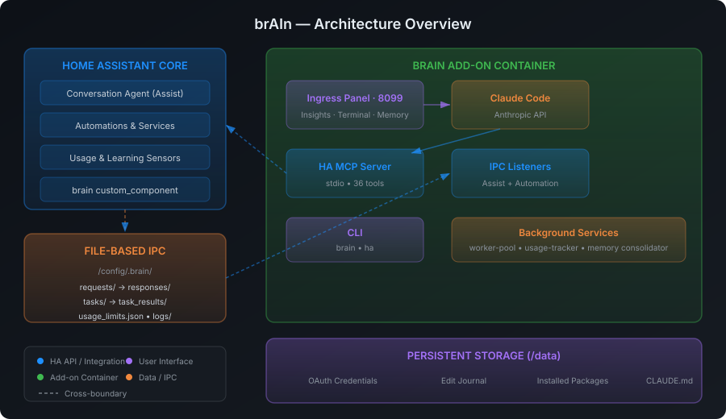

brAIn gives itself three ways to touch Home Assistant, and at first glance they look like three overlapping control panels. They're not — they're **one brain with one set of hands, plus a toolbox anyone in the house can reach**. This page explains what each layer is for, how they interact, and exactly where the (small, deliberate) overlap is.



## The three layers in one table

| | **CLI tools** (`brain`, `ha`) | **MCP tools** | **Power Tools** (`brain.*` services) |
|---|---|---|---|
| **What it is** | Shell commands in the terminal | Claude's live API into HA | Real HA services registered by the integration |
| **Who can call it** | You and Claude, in the terminal only | Claude only (terminal, voice, tasks) | **Anyone**: Claude, automations, scripts, Developer Tools, voice |
| **What it touches** | Files & workflow: YAML, logs, memory, undo, packages | Live state: entities, devices, cameras, history, registries, dashboards | Admin state: areas, labels, helpers, users, dashboards, zones… |
| **Example** | `ha reload automations` | `get_camera_snapshot`, `control_light` | `brain.create_helper` |

## How they fit together

**MCP is Claude's only pair of hands.** Everything Claude does to your live home — reading a sensor, turning on a light, looking at a camera, calling *any* service — goes through the MCP server's 36 tools. That single funnel is what makes safety enforceable: per-agent service deny-lists and voice tool-scoping are applied at that chokepoint, once, and cover everything.

**Power Tools are not a second pair of hands — they're verbs installed into HA itself.** Registering the 65 admin operations as real `brain.*` services (instead of private Claude abilities) is a deliberate choice with three payoffs:

1. **Claude reaches them through MCP** like any other service (`call_service` → `brain.create_area`), so the same deny-lists and budgets apply.
2. **Your automations and scripts get the same superpowers** with no Claude in the loop — a nightly automation can call `find_orphaned_references` by itself.
3. **You can drive them by hand** from Developer Tools → Actions, with field pickers and validation.

**CLI tools are the workshop bench**, and they only exist inside the terminal. They cover the file-and-workflow side that live APIs don't: editing and reloading YAML, tailing logs, the memory document, the edit journal, persistent packages. brAIn uses them for config work; you use them when you're in the shell anyway.

They are two commands, split by what they act on: **`brain`** for brAIn's own faculties (`memory`, `findings`, `learn`, `ask`, `undo`, `doctor`) and **`ha`** for Home Assistant operations (`log`, `reload`, `entity`, `service`, `addon`, `notify`, `share`, `check`, `context`). See [the CLI](/brain/cli/).

So the flow for any request is:

```text
"Label everything battery-powered and build me a guest-mode toggle"
        │
        ▼
   Claude (terminal / voice / task)
        │  MCP — the single funnel (deny-lists enforced here)
        ├── get_registry ─────────── read: which entities, which labels exist
        ├── call_service ──────────► brain.add_label        (Power Tool)
        └── call_service ──────────► brain.create_helper    (Power Tool)

"Fix my automations.yaml indentation and reload"
        │
        ▼
   Claude (terminal)
        ├── edits the file directly (terminal file access)
        └── ha reload automations                                  (CLI tool)
```

The rule of thumb:

> **Files → CLI. Live home → MCP. Admin changes → Power Tools (via MCP).**

brAIn's generated context teaches it this routing, so you never have to think about it — you just ask.

A few verbs appear in two layers on purpose — `ha service call` and `call_service` hit the same HA endpoint, one for you at a shell prompt and one for Claude (which always goes through MCP, because that's where the deny-lists live). Collapsing to a single layer would mean either taking services away from your automations or pushing YAML editing through an API that can't do it.

## What brAIn can and can't reach

The goal is an instance where Claude can do essentially everything — here's the honest scorecard:

**Fully covered:** entity/device control for every major domain; cameras; history and statistics; automations, scripts, and scenes (YAML + reload); areas, floors, labels; entity naming, ids, aliases, icons, visibility; helpers (all 8 types); zones; persons; users; dashboards including custom-card resources; blueprints; statistics backfill; integration enable/disable/reload **and removal**; device and entity deletion, including orphan sweeps that dry-run by default; repairs; logs, traces, templates; undo of any file it edited; and what *it* finds broken surfaces back into HA — an open-findings sensor, a `brain_finding` event, and an optional phone push.

**Deliberately excluded:**
- **Adding an integration** — config flows are interactive (OAuth, discovery, pairing buttons), so Claude walks you to the right screen and you click. *Removing* one it can do: `brain.delete_integration` drops the config entry and reports the entities and devices that went with it.
- **Credentials and auth internals** — API keys inside `core.config_entries`, tokens, MFA. Never read, never written, never snapshotted into the edit journal.
- **Backing up your configuration** — that's Home Assistant's own backups' job. brAIn keeps an [edit journal](/brain/reference/#undo) of the files it touched so `brain undo` can revert one, and nothing more.
- **HA Core/OS updates and add-on installs** — Supervisor territory; `ha addon` covers restarts and logs, but installs stay a human decision.

### YAML config is not an exception

Nothing on your disk is off limits. If a dashboard, helper or person is defined in YAML
rather than through the UI, the registry *service* for it declines — a `brain.*` service
edits the registry, and a YAML-defined object isn't in the registry. brAIn just takes the
other route: it opens the file, edits it, validates it, and reloads the domain. Same
outcome, and the same edit journal behind it, so `brain undo` still puts it back.

That is the routing rule doing its job, not a gap in what brAIn can reach. The only thing
you'll notice is which layer the work happened in.

### Three things happen without Claude

Everything above is Claude with a model in the loop, on your instruction. There are exactly
three exceptions, and each one is the narrowest thing that can do its job.

**A press on the Proposals tab writes to `/config`** — [accepting a
proposal](/brain/proposals/#saying-yes-and-taking-it-back), or removing a one-off that has
fired — with no Claude run behind it (1.44.0). The file is snapshotted into
the same edit journal first, the change is only settled once Home Assistant is verifiably
running it, the write is reverted if it is not, and both the toast and `brain undo` take it
back.

Since 1.46 that write has three shapes, because what the producers need is three different
things:

- **Append** — the ordinary case. One automation on the end of `automations.yaml`, or four
  [scenes](/brain/scenes/) on the end of `scenes.yaml`. Everything above them is byte-for-byte
  what you wrote.
- **Edit one entry** — a [condition proposal](/brain/proposals/#the-condition-it-is-missing)
  changes an automation you already have. brAIn replaces exactly the bytes of that one entry
  and **every byte outside it is identical afterwards**: your ordering, your comments, your
  quoting and every other automation in the file. It refuses rather than guessing where the
  entry ends — an id that appears twice, a file that is not a top-level list, an entry that
  cannot be cut on a line boundary — because nearly-right bytes are your file with a hole in
  it.
- **Remove one entry** — the same splice with nothing written in its place, and it has exactly
  one caller: the **Remove** button on a [one-off intent](/brain/intents/) that has fired.
  Nothing in brAIn removes an automation on its own.

`brain undo` covers all three, because all three snapshot the whole file into the same journal
before touching it, in the same line shape a Claude edit writes. What comes back is the file
as it was, not a reversal computed after the fact — so an undo of an edit puts your comments
back too.

**An accepted [emergency playbook](/brain/playbooks/)** is then run by **Home Assistant**, not
by brAIn — it is an ordinary automation in your `automations.yaml` once you have accepted it,
and brAIn has no path that fires one. It is composed deterministically from your registries
rather than by a model, every entity it would act on is listed on the card before you accept,
and no playbook ever unlocks a door or disarms an alarm.

**[Overnight self-healing](/brain/self-healing/)** is the one thing brAIn does to your house
with nobody's press behind it, and it is **off by default**. Switched on, it does three
things and no more — starts an add-on that was set to run at boot, pings a dead Z-Wave node,
reloads a config entry that failed to set up — once a night, inside your quiet hours, at most
three a night, never on a protected entity and never on a finding you have already answered.
There is no Claude run anywhere on that path.
