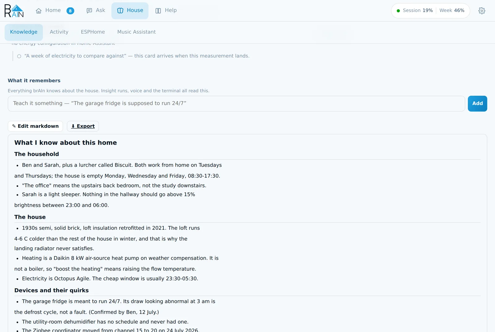
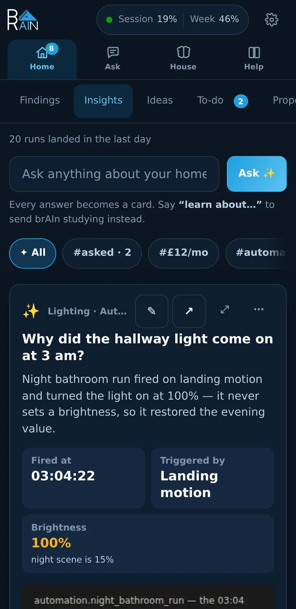

import { Card, CardGrid } from '@astrojs/starlight/components';

## What it is

A Home Assistant add-on that runs **Claude Code** and a suite of tools inside HA, which
builds a permanent memory of your house.

It sees the whole system — every entity, device, area, floor, dashboard, helper and
automation — and it can change any of it. Explain a broken automation. Fix it. Write a new
one. Remember why, next time.

That memory isn't a black box. Open it, read it, edit it, correct it. An insights panel
shows what it knows about your house and what it's done there — in the sidebar, or embedded
straight into your dashboards.

Reach it however you want: as your conversation agent, through a full-featured chat
interface, or from native Claude Code. Your automations can call it too — which means your
house can ask for help before you notice anything's wrong.

One install, one sidebar panel, one login. Runs on the Claude **Pro** or **Max**
subscription — or your own API key.

<CardGrid>
  <Card title="It runs Home Assistant" icon="setting">
    Not just "turn on a light" — **[65 admin services](/brain/power-tools/)** reach the
    parts of HA that normally live behind the Settings UI, plus **71 native tools** and a
    real shell in `/config`. [What it can reach →](/brain/how-brain-controls-ha/)
  </Card>
  <Card title="It finds what's broken" icon="magnifier">
    A dying battery, a sensor that stopped reporting three weeks ago, an automation
    whose trigger can never fire. Press **Fix it**, read the plan, and it makes the
    change. [Findings →](/brain/findings/)
  </Card>
  <Card title="It remembers your house" icon="open-book">
    One plain-markdown document of durable facts — nicknames, rhythms, the devices
    that are *meant* to behave oddly. Everything brAIn does reads it, and
    `brain memory export` carries it to new hardware — no starting over.
    [Memory →](/brain/memory/)
  </Card>
  <Card title="It explains your house" icon="star">
    Ask anything and get a card: the answer, the numbers and a chart. **Refine** it
    in a sentence, **Share** it as a picture or onto a dashboard.
    [Insights →](/brain/insights/)
  </Card>
  <Card title="It runs your ESPHome and Music Assistant" icon="rocket">
    Edit, validate and flash ESPHome devices, stream their logs, and clear out the
    stale speakers Home Assistant can't delete — from the panel or by asking.
    [ESPHome →](/brain/esphome/) · [Music Assistant →](/brain/music-assistant/)
  </Card>
  <Card title="It talks, in a voice you choose" icon="comment-alt">
    Pick brAIn in **Settings → Voice assistants**. Give it a personality, or run
    several agents with different names and permissions. [Voice →](/brain/voice/)
  </Card>
  <Card title="It has a terminal" icon="laptop">
    The real Claude Code CLI with your `/config` in front of it, as a chat or as a
    true terminal — one button between them. Several conversations stay open at
    once and switching stops nothing, so one left mid-answer is finished when you
    come back. Permission asks arrive as cards in the chat, it picks its own
    model, and conversations delete with an Undo. [Terminal →](/brain/terminal/)
  </Card>
  <Card title="It works from automations" icon="puzzle">
    `brain.run_task` for background jobs, scheduled insight reports rendered to
    sensors, and events your automations can trigger on.
    [Automations →](/brain/automations/)
  </Card>
  <Card title="It can be undone" icon="seti:config">
    Every file brAIn writes to is snapshotted first — the automation an accepted
    proposal adds included. **`brain undo`** lists the edits in plain English and puts
    one back. [The CLI →](/brain/cli/)
  </Card>
</CardGrid>

## It administers your setup

Most AI integrations can turn on a light. brAIn runs the installation. It reaches Home
Assistant three ways at once — native tools for reading and controlling, admin services
for the registry, and a shell for everything that is still a YAML file.

- **Organisation** — create, rename and delete areas, floors and labels; set icons and
  voice aliases; move devices and entities between them. *"Put every upstairs room on a
  floor called Upstairs and rename the Shellys to what they actually control."*
- **Devices and entities** — rename either, change an `entity_id`, hide, unhide, enable,
  disable. Find references to things that no longer exist and clean them up — dry-run
  first, so you see the list before anything goes.
- **Dashboards** — read, create, rewrite, restore a previous version. It can build a
  dashboard from a sentence.
- **Automations, scripts and scenes** — it edits the YAML, validates it, reloads the
  domain, then reads the **traces** to see whether the thing actually fired and why it
  didn't. That last part is what makes *"write me an automation"* work on the second try
  instead of never.
- **The house's own record** — history and long-term statistics, the logbook, the error
  log, your other add-ons, weather, camera snapshots it can actually *see*, and every
  service any integration exposes.

**Nothing is create-only.** Everything that can be created can be renamed and deleted,
and every attribute a `create_` service accepts has a service that changes it later.

## It fixes what it finds

A **finding** is something wrong with your house, filed by brAIn on its own while it was
looking at something else. Each one carries the evidence — the entity, the number, the
day it started — and what would resolve it.

Every card takes the same row of answers: **Fix it** (where software can — brAIn shows you
the plan first and changes nothing until you press **Apply**), **Add to list**, **Dismiss**
for "not now", and **Not a problem** for "you've got this wrong" — with a box for why,
which is the half that teaches. *"That sensor always reads on, it's not stuck"* becomes a
standing fact about your house, so the next run doesn't make the same mistake in new words.

Findings reach you without the panel open too: in Home Assistant's **Repairs**, as the
`todo.brain_system_brain` to-do list, as `sensor.brain_findings_open_findings`, and — with
**one option** set (`findings_notify_service`) — as phone notifications with the same
answer buttons and a **Reply**.

## It writes what you ask for, in a sentence

Some of the things on the [Proposals](/brain/proposals/) tab start with you rather than
with a pattern it found:

- **[A rule in a sentence](/brain/intents/)** — *"whenever the front door opens after dark,
  turn the hall light on"*. brAIn drafts the automation, **replays it over the last month**,
  grades it against what you actually did, and offers it with the case in one line — *would
  have fired 9 times; you'd already done the same yourself on 4*. **Try it for a week** first
  if you like.
- **[One-offs](/brain/intents/)** — *"turn the porch light off when the guests leave"*. An
  ordinary automation that **runs once and switches itself off**, left in your automations
  saying it fired until you press Remove.
- **[Four scenes for a room](/brain/scenes/)** — morning, day, evening and night, composed
  from what each bulb in that room can actually be told, shown as swatches before you say yes.
  Accept them and brAIn offers the schedule that moves between them, using the times it has
  measured for when your house gets up and settles.

## It acts, twice, and only because you said so

Everything above reports or proposes. Two things change the house, and both are decisions you
make once, in advance:

- **[Emergency playbooks](/brain/playbooks/)** — the automation you would want on a bad night:
  smoke or CO, a water leak, a freeze with the heating stopped. brAIn writes it from your own
  registries, lists every entity it would touch on the card, and **Home Assistant runs it, not
  brAIn** — only once you have accepted it. Rehearse it to see what it would do, against the
  house right now, changing nothing. No playbook ever unlocks a door or disarms an alarm.
- **[Overnight self-healing](/brain/self-healing/)** — **off by default**. Switched on, it
  does three dull things while you are asleep and nothing else: starts an add-on that was set
  to run at boot, pings a dead Z-Wave node, reloads an integration that failed to set up. Once
  a night, inside your quiet hours, three at most, never on a protected entity, and no Claude
  run anywhere on that path. The morning brief says what it did and whether it stuck.

## It learns, and everything reads what it learned

Memory is one markdown document you can open and edit. brAIn writes to it from
conversations, insight runs and background study sessions — and voice, insights and the
terminal all read it. Tell the voice assistant something and the cards know it.

When brAIn believes something it can't confirm, it says so as a **guess** you answer with
one tap — *"The garage fridge is meant to run 24/7 — right?"* Three open at a time, never
more. Guesses sit at the top of the **Findings** tab, because "is this broken?" and "have
I got this right?" are the same job — a question only you can answer — and one list should
hold everything waiting on you. **Yes** files it as a fact; **No** records a dead end that
is never revisited.

## It works from the sofa

The panel is one ingress page with four tabs — **Home**, **Ask**, **House** and **Help** —
built for a phone as seriously as a desktop: every target is at least 44px, cards
rearrange themselves for a narrow screen, and the terminal folds the chrome away when the
keyboard comes up.

## Built for Home Assistant

What makes this different from running Claude Code on a regular machine:

- **Your Claude subscription covers it** — OAuth sign-in, so Pro/Max includes your
  usage; an API key works too. One login covers the panel, the terminal, voice,
  insights and memory.
- **[71 purpose-built MCP tools](/brain/mcp/)** — live states, device control, cameras,
  history and statistics, registries, dashboards, traces, templates, logs, reloads, what
  brAIn has measured about your house, ESPHome and Music Assistant.
- **Auto-generated context** — every boot regenerates `/config/CLAUDE.md`, a snapshot of
  your install that Claude reads at the start of each session.
- **Usage-limit sensors** — the same session and weekly utilisation as claude.ai, as HA
  sensors with reset times, plus a budget that pauses *scheduled* work before it eats
  your week. Manual presses are never blocked.
- **Safe by default** — voice agents get HA tools but no shell, file or web access;
  per-agent blocked-service lists; a non-root sandbox behind an AppArmor profile
  (**6/6** on the add-on store's security rating); the terminal port ships
  unpublished *and* password-protected; `backup_exclude` keeps the Claude
  credential out of HA backups; `secrets.yaml` is never snapshotted and never
  edited.
- **Two CLI commands, not fourteen** — `brain` for its own faculties, `ha` for Home
  Assistant chores. [The CLI](/brain/cli/).
- **It can be checked, on your house** — `brain doctor` is free and answers whether the
  plumbing is connected; [`--deep`](/brain/doctor/) walks every face of the add-on with one
  real round trip each, and `--rehearse` plants a couple of defects here, scores the checks
  and the analyst against them, and takes everything back out. Neither ever runs on a timer.

## What it doesn't do

brAIn can't *add* an integration (config flows are interactive, so it walks you to the right
screen and you click — removing one it can do), never touches credentials, and doesn't back up your
configuration — Home Assistant's own backups already do that. What it keeps is an edit
journal of the files *it* touched — the automation an accepted
[proposal](/brain/proposals/) writes included — so `brain undo` can put one back. The full scorecard:
[what brAIn can and can't reach](/brain/how-brain-controls-ha/#what-brain-can-and-cant-reach).

:::caution[Back up Home Assistant first — somewhere that isn't this machine]
brAIn edits your real configuration: automations, dashboards, helpers, entities. It is
built to be careful, it snapshots files before it changes them, and `brain undo` puts them
back — but none of that is a backup you can restore from if something goes wrong.
**Settings → System → Backups**, then copy it off the device: a backup that only exists on
the machine you are changing is the one you cannot use when that machine is the problem.
:::

**[Quick Start →](/brain/quickstart/)** — add the repo, install (a prebuilt-image pull,
not a local build — a download, not minutes of compiling), restart HA once, sign in, press
**Start learning**. About five minutes, plus a few minutes of study in the background.
