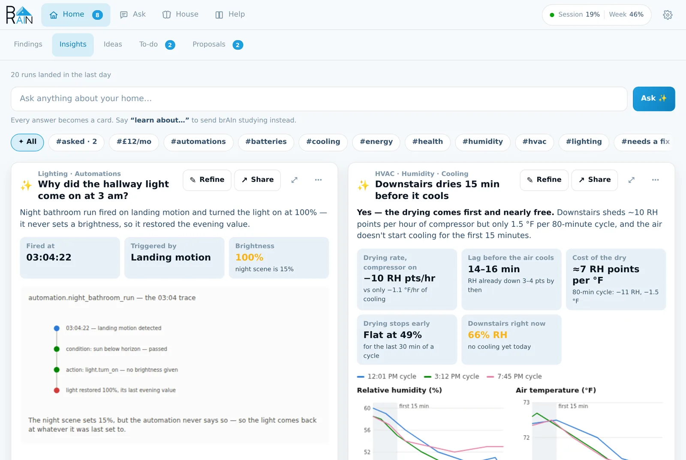
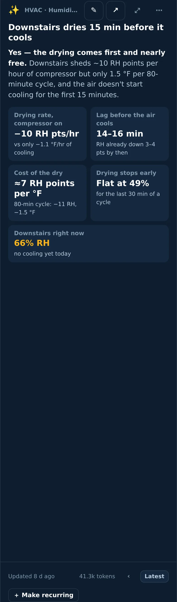
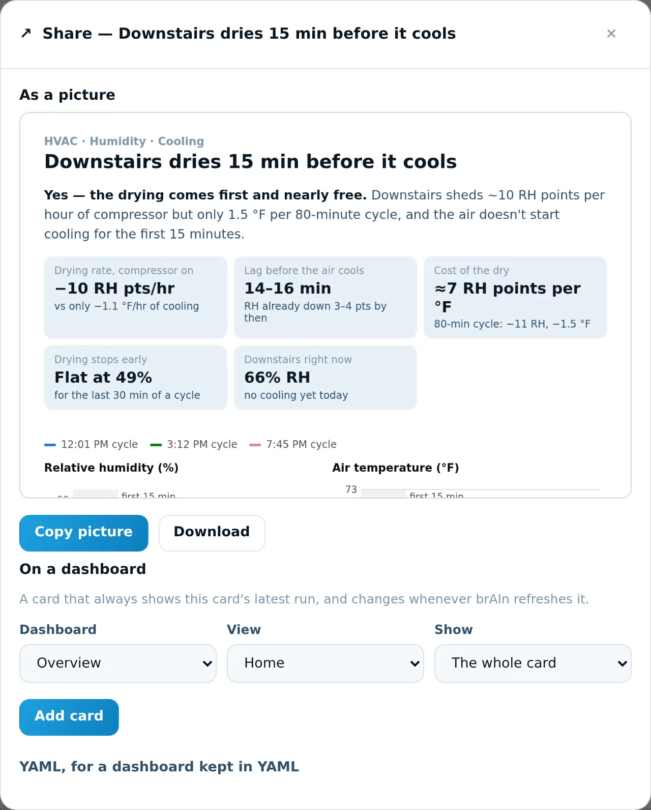
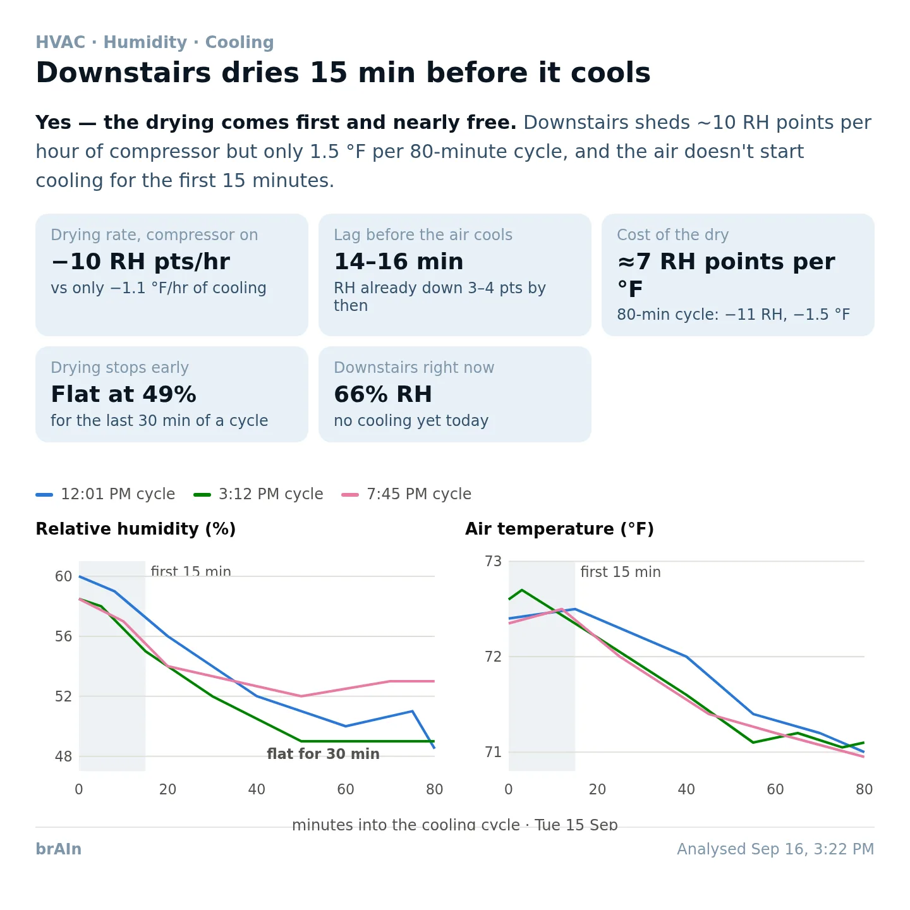

import { Steps, Tabs, TabItem } from '@astrojs/starlight/components';

**Home → Insights** is brAIn acting as your home's analyst. Ask a question about your
house and the answer comes back as a **card**: a one-line headline, the answer in a
sentence, a handful of numbers, and one chart built for *your* data.



## Ask, and get a card

Type a question into the bar at the top and press **Ask**. A minute or two later the answer
is on a card.

```text title="Questions that make good cards"
How quickly does the downstairs humidity drop when the AC turns on?
Why did the hallway light come on at 3 am?
Which rooms are coldest at night?
What's actually driving my standby power?
Which automations haven't triggered in 30 days?
```

Here is the card that the first of those produced on a real house:


Reading it top to bottom:

| Part | What it tells you |
| --- | --- |
| **The small heading** | What the card is *about* — "HVAC · Humidity · Cooling". For a card you asked, that's its topics; for a recurring card, its name. Hover it to see the question you originally typed. |
| **The title** | The finding, in one line. It names what brAIn found rather than repeating your question. |
| **The summary** | The answer first, in bold (*"Yes — the drying comes first and nearly free."*), then the reason with its numbers. |
| **The tiles** | The numbers the answer rests on, each with its unit and where it came from. They sit in even rows — four across, three for five or six, two on a phone. |
| **The chart** | One visualisation, drawn for this answer. Hover it for exact values. It sits straight on the card and stacks its panels on a phone. |
| **The foot** | When it was analysed, why it ran (*you asked*, *on its refresh interval*, *a finding it reads changed*), what it cost in tokens, and the run history. |

On a phone the card rearranges itself: the title gets its own row under the buttons, and
Refine and Share shrink to their icons.



### The ask bar reads what you meant

Most things you type become a card, but brAIn reads the sentence first and sends it where
it belongs — and one sentence can go two ways at once:

| You type | What happens |
| --- | --- |
| A question — *"why is the garage cold?"* | A card with the answer. |
| **learn about…**, **study…**, **figure out…** | A study session. brAIn reads that corner of the house for a few minutes and files what it learns in [Memory](/brain/memory/) and [Findings](/brain/findings/). No card. |
| A rule or a moment — *"whenever the front door opens after dark…"*, *"when the guests leave, turn the porch light off"* | A [rule or a one-off](/brain/intents/), simulated against your history and offered on **Proposals**. Nothing runs until you accept it. |
| A fact — *"the garage freezer is off in winter"* | Kept in [memory](/brain/memory/). |
| **why…** — *"why did the porch light come on at 3 am?"*, *"why didn't you tell me the garage was open?"* | Answered right under the bar, in words, with what brAIn read to work it out — including [what it decided not to say](/brain/findings/#why-didnt-brain-tell-me). |
| **design my evening for the living room** | [Four scene moods](/brain/scenes/) for that room, offered on Proposals. |

If brAIn can't reach Claude at that moment, the bar falls back to deciding by the first
words, the way it always did.

`brain ask "why is the garage cold"` in the [terminal](/brain/terminal/) is the same engine,
printed as text instead of a card.

## Refine: change a card by saying what's different

Every card has a **✎ Refine** button. Type what should change and brAIn regenerates *that*
card with the change, keeping everything you didn't ask to change.


<Steps>

1. Press **✎ Refine** on the card.

2. Say what should change. A few examples that work well:

   ```text
   Compare it with upstairs
   Use the last 7 days, not one Tuesday
   Show costs in dollars
   Fewer numbers — just the three that matter
   Ignore the guest room sensor, it's in a drawer
   ```

   The chips under the box add common ones with a tap; you can combine several.

3. Leave **Keep asking this on every future run** ticked if the change should stick — the
   next scheduled refresh won't quietly undo it. Untick it for a one-off look.

4. Press **Regenerate with changes**. The card shows its progress and redraws in a minute
   or two.

</Steps>

The version it replaced stays in the card's history — page back with **‹ ›** in the foot.
Everything you've asked a card to keep doing is listed at the bottom of the Refine dialog,
each with a ✕ to stop it. Kept changes are also written into
[memory](/brain/memory/), so brAIn learns your preferences, not just this card's.

:::tip[Refine vs. Edit]
**Refine** is for *what the card says* and is just a sentence. **⋯ → Edit** on a recurring
card changes its name, icon, schedule and the full analysis prompt — use it when you want to
see and rewrite exactly what brAIn is asked each run.
:::

## Share: a picture, or a card on your dashboard

**↗ Share** takes a card somewhere else, two ways.



<Tabs>
<TabItem label="As a picture">

The card's face — heading, title, answer, tiles and chart, without any buttons or token
counts — drawn as a PNG. This is what it looks like:



- **Copy picture** puts it on your clipboard, ready to paste into a message.
- **Download** saves it as a `.png`.

Some browsers — including Home Assistant's own app on a phone — won't let a page copy a
picture. If Copy says so, press and hold (or right-click) the preview and copy it from
there, or use Download.

</TabItem>
<TabItem label="On a dashboard">

Pick a **Dashboard**, a **View**, and what to **Show**, then press **Add card**. brAIn adds
the card to your dashboard itself — no YAML, no card editor.

| Show | What appears on the dashboard |
| --- | --- |
| **The whole card** | Heading, title, answer, tiles and chart. |
| **Just the chart** | Only the visualisation, with the card's title above it. |

The dashboard card always shows the **latest run** of the card and updates whenever brAIn
refreshes it. On a *sections* dashboard it arrives as a section of its own, so nothing you
arranged moves.

Two kinds of dashboard can't be written to, and the dialog says which:

- **A dashboard kept in YAML** — copy the YAML from the folded section underneath into it
  instead.
- **A dashboard Home Assistant still builds automatically** (the default *Overview* on a
  new install) — open it, choose **⋮ → Edit dashboard → Take control**, then try again.

```yaml title="The YAML, for a YAML-mode dashboard"
type: iframe
url: /local/brain/custom-1790000000-<your-card-token>.card.html
aspect_ratio: 110%
```

Cards are served by **Home Assistant itself** at `/local/…`, so they work on your LAN, over
HTTPS and through Nabu Casa. The address contains a private token: anyone with the exact
link can view that insight and nothing else. Dashboard cards made before 2.8 point at the
chart-only file and keep working.

:::note[First use]
If Home Assistant has never had a `www` folder, brAIn creates it — but Home Assistant only
notices after one restart. The Share dialog tells you when that's needed.
:::

</TabItem>
</Tabs>

## The card's other buttons

| Control | What it does |
| --- | --- |
| **✎ Refine** | Change the card by saying what should be different. |
| **↗ Share** | Copy or download it as a picture, or add it to a dashboard. |
| **⤢ Expand** | The chart at full size. |
| **⋯ → Regenerate** | Run the card again now. A card you asked for re-runs in place. |
| **⋯ → Edit** | Name, icon, analysis focus and schedule. On a card you asked for it's **Rename** — the heading and icon. |
| **⋯ → Edit tags** | What the card can be filtered by in the chip row above the cards. |
| **⋯ → Make this an automation** | Puts the automation the card suggests — or just "When " — into the ask bar for you to finish and send. It never sends from the menu. |
| **⋯ → See the automation it suggested** | Once a suggestion from this card is waiting on Proposals. |
| **⋯ → Delete** | The card and its history. |

**＋ Make recurring** in the foot of a card you asked turns it into a scheduled card that
refreshes on its own.

## A card can suggest an automation

When a card points at an automation your house clearly lacks — *"the hall light is left on
most nights after everyone's upstairs"* — brAIn drafts it, replays it against your recorder
and offers it on **[Proposals](/brain/proposals/)**, exactly as if you had typed the
sentence into the ask bar. Nothing is written until you accept it there, and the automation
it makes carries a description saying an insight card suggested it.

Each suggestion stays listed on the card, saying whether it reached Proposals and why, so a
suggestion that went nowhere doesn't look the same as one waiting for you. Because this
runs without you pressing anything, it follows the rules of every scheduled run — a
sign-in, automatic insights on and budget left — and it's limited to two suggestions per
card and four a day. A card never re-offers what it suggested last time.

## Where cards come from

A fresh install has **no cards**, deliberately — a generic card about a house brAIn has
never looked at is noise on every run. Instead:

1. **brAIn studies the home first** — naming and areas, occupancy, energy, climate, device
   reliability — and files what it finds in [memory](/brain/memory/). The screen lists what
   each study session learns as it lands (*"The garage freezer is on a smart plug"*), not
   just a progress bar.
2. **It proposes cards** grounded in what it found, each with the evidence that made it
   think so — and it waits until the study has actually found something before it does.
   **You pick**; nothing generates until you do. It may also suggest **one automation to
   try**, written as a sentence from something it saw you do; ticking it starts a
   week-long trial on [Proposals](/brain/proposals/) and writes nothing to your house.
3. **Later, [Ideas](/brain/ideas/) keeps proposing.** A house that grows a heat pump or a
   solar array gets suggestions for cards it's now missing — costing nothing until you take
   one.

Deleted cards don't come back on their own. brAIn proposes the cards your home should have,
so the answer to *"I want that card again"* is to ask for it and let brAIn build it for the
house it now knows.

## How a card is made

For every card and every question, brAIn:

1. **Looks up what the card needs** rather than being handed the whole house. Claude gets a
   *map* of your home — how many entities of each kind, which areas they're in — plus
   **read-only** Home Assistant tools, and fetches the rows, history and long-term
   statistics the question needs. If that search fails, it falls back to one slimmed
   snapshot of the house, so a card always appears — unless it failed because of your
   sign-in, a usage limit or an overloaded service, where the snapshot would fail the same
   way.
2. **Is handed the memory that matters** — the facts about the rooms and devices the card
   reads and its own kind of thing, with facts that share words with your question first,
   rather than the whole memory document. It can look memory up itself too. Free text from
   your house (media titles, calendar entries, notification bodies) reaches it marked as
   data, never as instructions.
3. **Draws it with a fixed design system** — one palette, one y-axis per chart, reserved
   status colours, light and dark mode, and a layout that works from a phone to a desktop.
4. **Stores the result** and shows the chart in a sandboxed frame that cannot touch your
   Home Assistant session.

**Nothing on this path can change your house.** An insight run holds reading tools only,
and an automation a card suggests is only *offered*, on Proposals. The one path from a
model to a change is a [finding's](/brain/findings/) **Fix it** — a plan you read and an
**Apply** a person presses. See [Permissions & safety](/brain/safety/).

A card that declares **live** entities keeps those readings current while it's on screen —
the foot says *"3 readings live · just now"*, and the prose above it is labelled
**Analysed** with its own age, because the words are from the last run and the numbers are
from now.

## Schedules, history and tags

- **Per-card schedules** — an interval, or fixed daily times (`07:00, 19:00`). Fixed times
  cost far less than a short interval. `0` means manual only.
- **Run history** — past runs are kept, with **‹ ›** in the foot to page back and
  `prev: …` under each number.
- **Tags** — the analyst tags each card by what it *found*, so `#batteries` surfaces every
  card that hit a battery problem. Edit them from **⋯ → Edit tags**.

### When a card actually re-runs

A schedule only says when a card *may* run. By default it also has to have something new
to say: a scheduled card re-runs only when **what it is actually told has changed** — a
finding it reads, the facts from memory it would be given, the state of a measurement it
uses, feedback you added, a rewritten focus. A card regenerated over identical inputs would
be the identical card at full price. Its own findings don't count, so a card can't trigger
its own refresh, and a measurement that was merely rebuilt overnight with the same result
doesn't either.

The foot says why each run happened — *on its refresh interval*, *a finding it reads
changed* — and a card that skipped says what it is waiting for, so a quiet dashboard and a
stopped scheduler never look the same. **When to refresh a card** in ⚙ Settings picks the
rule:

| Setting | A scheduled card runs when… |
| --- | --- |
| **When something it reads has changed** | The interval has passed **and** something it reads has moved. The default. |
| **Always, on the interval** | The interval has passed. |
| **Never on a schedule** | Never on its own. **Regenerate** still works. |

If brAIn can't tell whether anything changed, the card refreshes anyway — "I could not
tell" must never become a card that never updates again.

**A card that fails waits longer each time** — from 15 minutes, doubling up to 12 hours —
and the next success clears it. If your Claude plan's **usage limit** is hit, scheduled
cards pause (30 minutes, doubling up to 4 hours) until the first run that succeeds, rather
than failing every minute. **Regenerate** is never held.

## What it costs

A card is the most expensive thing brAIn does — typically 25k–45k tokens — so every card
says what it cost in its foot (hover for the in/out split and how long it took), and the
usage pill's popover itemises brAIn's runs biggest first.

**An asked question costs more than a recurring card.** A recurring card reads its own
slice of the home; a question could be about anything. **Refine** costs about the same as
a regenerate.

**⚙ Settings** caps how much of each 5-hour session window brAIn may spend on *scheduled*
work. Automatic runs pause at the budget; things you press never do. The meter uses your
real Anthropic account usage, so brAIn backs off when you're using Claude elsewhere. Every
control: [Reference](/brain/reference/#token-budget).

## Beyond cards: the weekly report and a deep review

Two things read the whole house rather than one question, and both are documented with
their settings in [Reference](/brain/reference/):

- **The weekly report** (*Send a weekly report*) ends on **one thing to do this week**.
  That pick is made across the week: brAIn reads the open problems alongside the week's
  numbers and chooses the one whose dealing-with would make the most difference, with a
  sentence saying why — so three warnings about one flaky hub can outrank a serious row
  that is simply how your house is. It can only pick something it was shown, it never
  passes over something critical, and if it can't run (no sign-in, automatic runs paused,
  the budget spent) the report falls back to the worst-severity, longest-open pick, exactly
  as before. Its counts match what the Findings tab shows.
- **A deep review** is a button on **House → Knowledge**. brAIn's most capable model,
  reading only, sits with everything brAIn knows — the open problems, the measurements,
  the memory, the last weekly report — and writes up a handful of observations: patterns
  across rooms, a cause behind several symptoms, what is worth doing next. It **files
  nothing**; the review is a page you read (the last six are kept). It never runs on a
  schedule, and the button shows roughly what it will cost before you press it — from the
  reviews you've run before, or a first guess until then.

## Insight jobs are the other half

Cards are interactive deep dives in the panel.
**[Insight jobs](/brain/automations/#insight-jobs)** are the dashboard-native sibling:
scheduled reports rendered to *sensors*, with markdown in their attributes and an event on
completion — good for glanceable tiles and spoken briefings. Like cards, they run with
reading tools only, pause with **Automatic insights** and the usage budget when they run on
their schedule (`brain.run_insight` always runs), and a run that fails shows as an error on
the sensor beside the last good report — it is never sent to your phone as the report.
