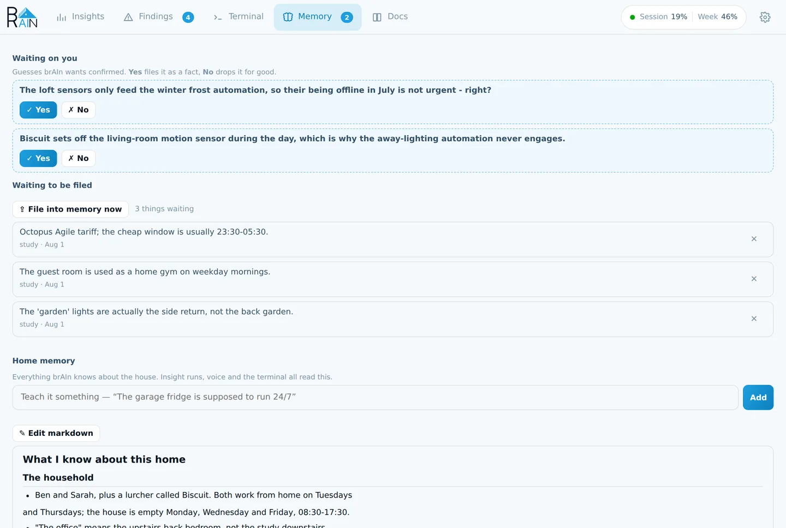

brAIn keeps one small, human-readable document about your home at `/config/.brain/memory/memory.md` — preferences, entity nicknames, household patterns, device quirks. It's what turns *"turn on the beacon"* into the office lamp, and every surface in the add-on reads and writes it: the terminal, voice, insight runs, study sessions.

The whole design answers one question: **what, exactly, has it learned?** If you can't point at a line and say "it knows that", it isn't memory.



## What ends up in it

Real lines from a real document — the kind of thing that changes an answer rather than
padding a profile:

- *"The office" means the upstairs back bedroom, not the study downstairs.*
- *Sarah is a light sleeper. Nothing in the hallway should go above 15% brightness between
  23:00 and 06:00.*
- *Heating is an 8 kW air-source heat pump on weather compensation. It is not a boiler, so
  "boost the heating" means raising the flow temperature.*
- *The garage fridge is meant to run 24/7. Its draw looking abnormal at 3 am is the defrost
  cycle, not a fault.*
- *Never rename an entity_id without asking — several are referenced in a Node-RED flow I
  cannot see.*

That last kind matters more than it looks: memory is where you put the rules you'd
otherwise have to repeat in every request.

## One document, one writer

| What | Where | Is it memory? |
|------|-------|---------------|
| `memory.md` | `/config/.brain/memory/` | **Yes.** The canonical document — plain markdown, **user-editable**, capped at `memory_max_kb` (default 32 KB, range 1–64). |
| `voice.md` | `/config/.brain/memory/` | Derived. A ≤2 KB distillate spliced into voice prompts. Don't edit it; it's regenerated. |
| `inbox/` | `/config/.brain/memory/` | No — a **queue**. Candidate facts waiting to be folded in. |
| Hypotheses | `/config/.brain/memory/` | No — a **queue**. Open guesses awaiting a yes/no. |
| Change log | `/config/.brain/memory/` | No — an **audit trail**, so you can see what changed and undo it. |

Only the queues are ever written to directly. **Nothing writes `memory.md` except the consolidator**, which folds the inbox in once a day (or early when 20+ facts are pending), deduping, resolving contradictions newest-wins, and enforcing the size cap. One writer means no races, and it means the document stays a document rather than an append-only log.

The cap is not a speed setting. Voice reads the 2 KB `voice.md` distillate on every request and never the document, so shrinking `memory.md` buys nothing where speed is felt — the cap only decides how much brAIn can know before filing something new means dropping something old.

**⇪ File into memory now** on the Memory tab runs that same pass immediately — same script, same safety checks. The button *starts* the pass rather than waiting for it — a consolidation takes minutes, and a web request can't — so a banner counts the elapsed time and the tab reports the outcome when it lands. It empties **Waiting to be filed**, and what was in it is now in the document, which is the one place it's read and edited from. If the pass keeps the facts instead — it does that rather than write a document it isn't happy with — it says so, and the queue stays where it was.

**Waiting to be filed** is the inbox itself: every queued line, labelled with where it came from — an insight run, a voice conversation, a correction, something you typed — and the count is the length of that same list, so the two can never disagree. **✕** on a row drops it from the queue and asks the consolidator for nothing, because a queued fact has by definition never reached the document — there is nothing to forget.

The inbox, the hypothesis queue, and the change log are **never injected into prompts**. They're plumbing, not knowledge.

:::note[A consolidation can't quietly erase what it knows]
A pass that would drop more than 60% of the document's content lines is refused outright,
and any failure leaves memory untouched with the inbox still pending. Nothing is ever
half-written: both `memory.md` and `voice.md` are replaced atomically or not at all.

A pass gets 480 seconds — it rewrites the whole document plus the voice distillate — and a
failure is reported by name: a timeout says it timed out, anything else carries Claude's own
last line. An answer over the size cap is retried once with the measured excess fed back
("drop the oldest and lowest-value facts until it fits") before failing with a message that
names `memory_max_kb`.
:::

## How it learns

- **You tell it** — say *"remember that…"* to a voice assistant, run `brain memory add "…"` in the terminal, or call `brain.add_memory` from an automation.
- **It notices** — when a voice conversation ends, a bounded reflection pass (cheap model, no tools) extracts up to 3 durable facts: preferences, corrections, nicknames. Transient states, one-off commands, and secrets are excluded.
- **It studies** — `brain learn <topic>` (or the `brain.study` service, or `/learn` in the terminal) runs a deep session on one subject and files what it finds. Without a topic it picks whatever has gone stalest.
- **It analyses** — insight runs file their durable findings the same way, through the same inbox.

## Guesses, not questions

Earlier versions asked open-ended questions, which piled up unanswered and left you reading raw Q&A transcripts. brAIn instead states what it **believes**, phrased for a yes/no:

> *"The garage fridge is meant to run 24/7 — right?"*

Two taps settle it, on the [Findings](/brain/findings/) tab — open guesses ride at the top
of the same list as findings, because both are questions only the person living there can
answer, and one badge counts everything waiting on a decision. The Memory tab has no badge,
because nothing on it waits on you: the queue files itself, and the document is there to
read.

- **✓ Yes** files it as a plain memory line. It's now a fact like any other; the guess is gone.
- **✕ No** records a dead end that is never revisited, in any wording — and offers the same
  optional one-sentence reason box a wrong finding does, because "no" usually means brAIn
  has misread something worth explaining.

The rules are enforced in code, not merely requested in a prompt — a model that ignores the budget still can't grow the queue:

- **3 open at a time**, maximum.
- **14-day expiry** — an unanswered guess retires itself.
- **Never re-proposed**, confirmed or rejected, however it's reworded.

`binary_sensor.brain_waiting_on_you` turns on when a guess needs an answer, with the text in its `pending` attribute. That exists to be automated: a guess sitting in a panel nobody has open expires unanswered, but pushed to a phone it costs one tap.

## Learning you can see from outside the panel

- **`brain_learned`** fires as a logbook event for every new fact, so *"brAIn learned: the hallway sensor drops offline around 2am"* appears in your home's timeline next to lights and doors.
- **`sensor.brain_facts_learned`** — how many things it knows.
- **`sensor.brain_last_learned`** — the most recent one, with the text as an attribute.
- **`sensor.brain_open_findings`** — how many findings are waiting on you, with the severity
  split and the texts as attributes.
- **`brain_finding`** fires for every newly-filed finding — and can ring your phone; see
  [getting them to your phone](/brain/findings/#getting-them-to-your-phone).

## Viewing, editing, undoing

The **Memory** tab shows the document formatted, with **✎ Edit markdown** for the raw file
and a **Teach it something** box that merges a new fact straight in. Everything there is
also on the command line:

```bash
brain memory list                        # what it knows
brain memory add "Guests use the loft"   # queue a fact yourself
brain memory inbox                       # facts awaiting consolidation
brain memory hypotheses                  # pending guesses
brain memory consolidate                 # run a consolidation pass now
brain memory log                         # what changed recently, and why
brain memory undo 2                      # revert memory change #2 from that log
brain memory forget "the loft is warm"   # queue a line for removal
brain memory edit                        # open memory.md in $EDITOR
brain memory clear --confirm             # reset (old file kept as memory.md.bak)
brain memory export                      # everything learned, as one portable file
brain memory import backup.json          # fold an export back in

brain learn energy                       # study a topic now
brain learn                              # study whatever is stalest
```

`memory.md` is yours. Edit it freely — **your edits are the source of truth**, and the consolidator merges around them rather than over them. `brain memory log` shows every change the consolidator made, in plain English, and `brain memory undo <n>` reverts one.

:::note[Two different undos]
`brain memory undo` reverts a change to what brAIn *knows*. Plain
[`brain undo`](/brain/cli/#undo) reverts a change Claude made to a *file* in your `/config`.
They're separate journals, and neither can touch the other's.
:::

## The learned home is portable

`brain memory export` writes one JSON file carrying everything brAIn has learned: the memory
document, the [findings](/brain/findings/) work list, the settled answers and the facts
ledger. The Memory tab's **⬇ Export** button downloads the same file
(`GET /api/memory/export`).

Import is CLI-only, and it is a **migration, not a sync**: ledgers merge with your existing
entries winning, the memory document replaces only an effectively-empty one unless you pass
`--replace-memory`, and importing the same file twice changes nothing the second time. The
point is that new hardware doesn't mean starting the learning over — export on the old box,
import on the new, and brAIn picks up already knowing the house.

## Services

```yaml
# Queue a fact from an automation
action: brain.add_memory
data:
  fact: "The dog gets fed at 7 and 17 — kitchen lights on then means feeding time"
  confidence: high     # high | medium | low (default medium)

# Study a topic in the background; results arrive in memory, not in a response
action: brain.study
data:
  topic: "energy"      # omit to study whatever has gone stalest
```

## Kill switches

- `learning: false` — the master switch. Stops the reflection pass, the consolidator, and study sessions. Existing memory is left untouched and still used.
- `memory_injection: false` — keep learning, stop splicing memory into voice prompts.
- `brain memory clear --confirm` — forget everything learned so far.
