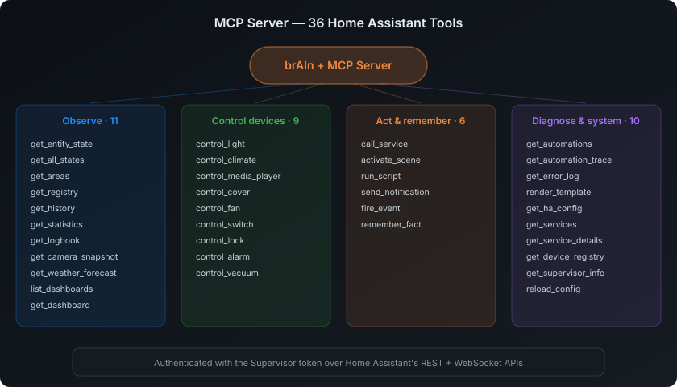
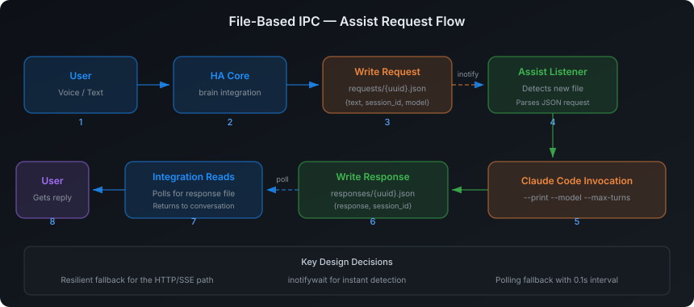

Everything you might need to look up. Configure from **Settings → Add-ons → brAIn → Configuration**. The defaults work out of the box; the tables below mirror `config.yaml` as shipped.

## Configuration options

### Faces

One ingress panel serves everything; these turn either face off. The panel itself always runs, because it is the ingress target.

| Option | Default | What it does |
|--------|---------|--------------|
| `enable_terminal` | `true` | Run the ttyd terminal and show the **Terminal** tab. Off gives a dashboard-only install with no shell. |
| `enable_insights` | `true` | Run insight generation and show the **Insights** tab. |

### Startup

| Option | Default | What it does |
|--------|---------|--------------|
| `auto_launch_claude` | `true` | Launch Claude Code immediately in the terminal. `false` lands on the shell with a session picker instead. |
| `auto_generate_context` | `true` | Regenerate `/config/CLAUDE.md` on boot — a snapshot of your install (entities by domain, automations + states, add-ons, integrations, file tree, the two CLI dispatchers) that Claude reads at the start of each session. |
| `enable_mobile_ui` | `true` | Splice the touch toolbar + iOS fixes into the terminal. `false` falls back to ttyd's stock UI. |
| `log_level` | `info` | `trace`, `debug`, `info`, `notice`, `warning`, `error`, `fatal`. Bump to `debug` when filing a bug. |

### Native HA integrations

| Option | Default | What it does |
|--------|---------|--------------|
| `enable_ha_mcp_server` | `true` | The MCP server that gives Claude live entities, device control, cameras, history, traces, logs, templates, and reloads. |
| `enable_assist_integration` | `true` | Run as a conversation agent in HA Voice Assistants. |
| `assist_fast_mode` | `true` | Keep pre-warmed Claude workers alive for voice (one per active conversation plus a hot spare) so turns skip the CLI boot and MCP handshake. ~150–300 MB RAM per warm worker (max 3). `false` uses the classic spawn-per-request listener. |
| `enable_automation_integration` | `true` | Trigger brAIn tasks from automations via `brain.run_task`. |

### Memory and learning

| Option | Default | What it does |
|--------|---------|--------------|
| `learning` | `true` | Master switch for **everything** brAIn learns: the end-of-conversation reflection pass, the consolidator, and study sessions. Turning it off leaves existing memory in place and still used. |
| `memory_injection` | `true` | Splice learned memory into voice prompts. |
| `memory_max_kb` | `32` (1–64) | Size cap for the memory document. Not a latency setting — voice reads the ≤2 KB `voice.md` distillate on every request, never the full document, so shrinking this buys nothing where speed is felt. |
| `study_max_turns` | `60` (0–500) | Turn cap for a study session. **`0` removes the cap.** |
| `study_timeout_minutes` | `30` (2–120) | Wall-clock limit for a study session. |

### Findings notifications

The [Findings](/brain/findings/) tab, `sensor.brain_open_findings`, and the `brain_finding` event work with or without these — this pair only decides whether a new finding also rings your phone.

| Option | Default | What it does |
|--------|---------|--------------|
| `findings_notify_service` | *(empty)* | A `notify.*` service (e.g. `notify.mobile_app_your_phone`) that gets a push whenever brAIn files a **new** finding. Empty = no push. The store dedupes across every status and the settled ledger, so the same problem can never ring twice. |
| `findings_notify_min_severity` | `serious` | Only findings at or above this severity (`info` → `warning` → `serious` → `critical`) are pushed. The default means dying batteries and sensors gone silent reach your phone, while naming nitpicks wait on the tab. |

### Turn budgets

These cap how many agentic loops brAIn runs before returning.

| Option | Default | What it does |
|--------|---------|--------------|
| `assist_max_turns` | `8` (1–40) | Per-request cap for the voice agent. Deliberately modest: latency *is* the product for voice, and the cached area map means most commands take one or two turns anyway. |
| `automation_max_turns` | `30` (1–200) | Per-request cap for automation tasks. Nobody is waiting on those, so it's generous. |
| `study_max_turns` | `60` (0–500) | See above. |

:::note[Why the study limits are generous]
A turn cap is not a safety valve — it **truncates**. A study session that hits one stops mid-thought and produces nothing parseable, so the whole run is wasted *after* paying for every token. That makes a tight cap the most expensive setting in the add-on. Depth is the entire point of a study session, so the honest guards are wall-clock time and your account's own usage budget, not turn count. Hitting a limit is reported as hitting a limit, and study prompts tell the model to land its result if it senses it is running short, so a long session degrades to partial rather than losing everything.
:::

### Insights

| Option | Default | What it does |
|--------|---------|--------------|
| `auto_refresh_hours` | `24` (0–168) | How often recurring cards regenerate when they have no schedule of their own. `0` disables scheduled refresh — manual only. |
| `history_days` | `7` (1–30) | How many days of history/statistics each analysis sees. |
| `history_keep_runs` | `40` (0–200) | Past runs kept per card for the run selector. `0` disables history. |
| `history_keep_days` | `30` (0–365) | Past runs older than this are pruned. `0` disables history. |
| `model` | *(empty)* | Claude model override (e.g. `claude-sonnet-4-5`). Empty = the CLI default. |
| `generation_timeout_minutes` | `8` (2–30) | Hard per-generation timeout. |

These are also editable from the panel's **Settings** dialog, which writes changes back here through the Supervisor — both screens always show the same value.

Generation runs **one card at a time** through a queue, which keeps things friendly to subscription rate limits.

### Edit journal

| Option | Default | What it does |
|--------|---------|--------------|
| `edit_journal_days` | `14` (0–365) | How long to keep snapshots of files Claude edited. `0` disables the journal entirely. See [Undo](#undo). |

### Permissions & tool scoping

| Option | Default | What it does |
|--------|---------|--------------|
| `assist_tool_access` | `mcp_only` | What voice may do. `mcp_only` allows every HA MCP tool (full device control, cameras, history, any service call) but denies shell, **all** file access, and web — so voice can't author automations or read `secrets.yaml`. `full` lifts the restriction. |
| `dangerously_skip_permissions` | `false` | **Interactive terminal only.** Skips per-action confirmation prompts. Background channels (voice, automations, insights, study) are unaffected — they use a pre-approved allowlist instead. |

:::note[Per-agent blocked services]
Beyond the coarse `assist_tool_access` switch, each voice agent has its own **Blocked services** picker (in its config) — patterns like `lock.unlock` or a whole `alarm_control_panel.*` that *that* agent may never call. It's enforced in the MCP server's `call_service` chokepoint, so it covers every device tool and phrasing, not just the generic call.
:::

### Volume access

The container always mounts `/share`, `/media`, `/backup` (read-only), `/addon_configs`, and `/addons`. Toggling one off doesn't unmount it — it stops Claude's tools from being pointed at it (defence in depth).

| Option | Default |
|--------|---------|
| `access_share` | `true` |
| `access_media` | `true` |
| `access_backup` | `true` |
| `access_addon_configs` | `true` |
| `access_addons` | `true` |
| `additional_directories` | `[]` — extra absolute container paths to expose |

### Persistent packages

The container is rebuilt fresh on every update. These keep your tools installed across rebuilds.

| Option | Default | Example |
|--------|---------|---------|
| `persistent_apk_packages` | `[]` | `["vim", "htop", "ripgrep"]` |
| `persistent_pip_packages` | `[]` | `["pandas", "requests"]` |

## Recommended presets

### Quiet — terminal only

```yaml
enable_terminal: true
enable_insights: false
auto_launch_claude: true
auto_generate_context: true
enable_ha_mcp_server: true
enable_assist_integration: false
enable_automation_integration: false
learning: true
```

### Everything on

```yaml
enable_terminal: true
enable_insights: true
enable_ha_mcp_server: true
enable_assist_integration: true
assist_fast_mode: true
assist_tool_access: mcp_only
enable_automation_integration: true
assist_max_turns: 8
automation_max_turns: 30
study_max_turns: 0        # no cap — let it dig
study_timeout_minutes: 45
learning: true
```

## The panel

One ingress panel on port **8099**, with five tabs. Each has its own page:

| Tab | What it is | |
|-----|-----------|---|
| **Insights** | Cards proposed for your home, and an ask bar with two verbs | [Insights](/brain/insights/) |
| **Findings** | The work list: what brAIn thinks is broken, plus the guesses awaiting a yes/no | [Findings](/brain/findings/) |
| **Terminal** | Claude Code as a chat or as a true terminal, one session | [Terminal](/brain/terminal/) |
| **Memory** | The document, and the queue that files itself into it | [Memory & Learning](/brain/memory/) |
| **Docs** | The same guide, shipped inside the add-on and searchable offline | |

A number on the **Findings** tab means something is waiting on your decision — a broken
thing to settle **or** a guess to confirm; both kinds of question live in that one list.
The **Memory** tab has no badge, because nothing on it waits for you.

### Panel settings

These live in the panel's **⚙ Settings** dialog, not the add-on Configuration tab, and take
effect without a restart. Anything left unset falls back to the add-on option of the same
name.

| Setting | Values | What it does |
|---------|--------|--------------|
| `auto_enabled` | on / off | Master pause for all *scheduled* work. Manual presses always run. |
| `plan` | `pro`, `max5`, `max20` | Which Claude plan you're on — only used to estimate a session window when there's no real utilisation to read. |
| `budget_percent` | 5–100 (default 25) | How much of each 5-hour session window scheduled work may spend. |
| `terminal_ui` | `chat`, `classic` | Which face the Terminal tab opens in. Default `chat`. |
| `model` | preset or a custom model id | The model insight generation uses. |
| `chat_model` | a model id, or unset | The chat terminal's own model, picked **from the chat** (the model name under the composer, or ⋯ → Model). Unset follows the global `model` — and deliberately never writes it, which would silently change what every insight run costs. |
| `chat_max_sessions` | 1–8 (default 3) | How many chat conversations keep a live Claude Code process. It counts **processes, not conversations** — you may have as many of those as you like. Past it, the session untouched for longest is closed (never one mid-answer) and reopens where it left off. |
| `gather_mode` | `search`, `snapshot` | **How a card gets its data.** `search` (default) sends Claude a *map* of the home plus read-only HA tools, so it looks up only what the card needs — and it's the only mode that can afford history on a typed question. `snapshot` is the old send-everything path, kept as a setting and as the automatic fallback when a search run fails. |
| `refresh_hours`, `history_days`, `history_keep_runs`, `history_keep_days`, `timeout_minutes` | | Same meaning as the add-on options below. |

### Token budget

`budget_percent` caps how much of each 5-hour session window brAIn may spend on **scheduled**
work; automatic runs pause at the budget, manual presses never do. The meter uses your **real
Anthropic account utilisation** from the usage-limits tracker, so brAIn backs off when *you*
are using Claude elsewhere.

The topbar pill keeps both windows in view — `Session 19% · Week 46%`. **Press it** for the
reset times and what the budget gates; it's a press rather than a hover because a tooltip is
unreadable on the device where that pill matters most. Only the session is budgeted against;
the week is shown because a session that looks fine says nothing about a week that doesn't.
Neither number exists without a subscription login, so with an API key the session falls back
to an estimate of brAIn's own spending and the week isn't shown at all.

## Voice assistant (Assist)

Select **brAIn** as a conversation agent in **Settings → Voice Assistants**. Each agent has its own name, model, personality, and blocked-services list. New agents default to Claude Haiku (`Default` inherits the terminal's model); `brain.clear_conversation` resets conversation memory (omit `conversation_id` to reset all). How it works — fast mode, the area map, personalities: [Voice Assistant](/brain/voice/).

## Insight jobs

Scheduled reports rendered to **sensors**, created from **Settings → Devices & Services → brAIn → Add Service → Insight job**. The report lands in the sensor's attributes: `preview` (first lines), `markdown` (full report), `card_yaml` (ready-to-paste card). A `brain_insight_complete` event fires after every run with `name`, `entity_id`, `success`, and `preview`. Templates, scheduling, and dashboard recipes: [Automations & Insight Jobs](/brain/automations/#insight-jobs).

## HA services

```yaml
# Send a prompt and wait for the response
action: brain.send_prompt
data:
  prompt: "What entities are offline?"
  timeout: 120
  model: haiku        # optional per-call override

# Run a task in the background, with optional notification
action: brain.run_task
data:
  prompt: "Check today's error log and summarise the issues"
  notify: true
  notify_entity: notify.mobile_app_phone   # where the notification goes; omit for a persistent notification
  model: haiku        # optional per-call override
  timeout: 300

# Run one or all insight jobs now
action: brain.run_insight
data:
  name: "Daily Briefing"   # omit to run all

# Do one thing next time. Returns immediately; the card lands on Proposals.
action: brain.intent
data:
  sentence: "Turn the porch light off when the guests leave"

# Study the home. Returns immediately; results arrive in memory.
action: brain.study
data:
  topic: "energy"          # omit to study whatever has gone stalest

# Teach it something durable
action: brain.add_memory
data:
  fact: "The garage fridge is meant to run 24/7"
  confidence: high         # high | medium | low
  source: "spouse"         # optional — where the fact came from (default "service")

# Answer one of brAIn's open questions — recorded, and queued as a fact
action: brain.answer_question
data:
  question: "Is the garage fridge meant to run 24/7?"
  answer: "Yes, it holds the overflow from the kitchen."

# Reset conversation memory
action: brain.clear_conversation
# data: { conversation_id: "..." }   # omit to clear all
```

`brain.intent` needs **1.46**. It queues the sentence and returns straight away — Claude has
to search the house for what it names — and what comes back is a card on the Proposals tab,
including when brAIn will not arm it. Nothing is written until you accept it. See
[one-off intents](/brain/intents/).

Plus the **65 [Power Tools](/brain/power-tools/)** services for registry administration.

## Sensors

### Learning sensors

| Entity | Reports |
|--------|---------|
| `sensor.brain_facts_learned` | How many things brAIn knows |
| `sensor.brain_last_learned` | The most recent fact, with the text as an attribute |
| `binary_sensor.brain_waiting_on_you` | On when a guess needs a yes/no, with the text in `pending` |

A **`brain_learned`** logbook event fires for every new fact, so learning appears in your home's timeline next to lights and doors — see [Events](#events).

### Findings sensor

`sensor.brain_open_findings` exists to be *automatable* — the panel's badge answers the same question, but a badge cannot ring a phone at a sensible hour or sit on a dashboard. State is the open count; attributes carry the severity split (`critical` / `serious` / `warning` / `info`), the finding texts (first 20), and `newest`, because an automation that only knows "3" cannot put what is actually broken on a lock screen. It reads the mirror the add-on republishes to `/config/.brain/findings_state.json` on every findings change, and stays **unavailable until the add-on has written one** — which is what tells a fresh install apart from a clean bill of health.

### Usage-limit sensors

Your real Anthropic account utilization — the same numbers as **claude.ai → Settings → Usage**, not estimates. A background tracker queries the Anthropic usage endpoint every **30 minutes** (the endpoint meters requests **per day**, so a chattier poll works all morning and then hits a wall of 429s until the small hours — 48 requests a day never does); the sensors poll the tracker's file every 30 seconds.

| Sensor | Tracks | Key attributes |
|--------|--------|----------------|
| Session Usage | Percent of the current 5-hour session window used | `resets_at`, `data_source`, `last_updated` |
| Session Usage Resets At | When the 5-hour window resets | `utilization` |
| Weekly Usage | Percent of the rolling 7-day window used | `resets_at`, `data_source`, `last_updated` |
| Weekly Usage Resets At | When the 7-day window resets | `utilization` |

:::caution
These need an **OAuth / subscription login**, **not** an `ANTHROPIC_API_KEY`. With an API key — or before you've signed in — they stay **unavailable**. And during a streak of 429s from the usage endpoint the four sensors **will go unavailable by design**: the tracker's backoff (1, then 2, then 4 hours) deliberately exceeds the two-hour window after which a reading is too old to trust, because retrying a daily-metered endpoint is what sustains the limit. Either way, the reason lives on the **Usage tracker** diagnostic sensor below — HA hides the attributes of an unavailable entity, which is exactly why the explanation lives somewhere that never goes unavailable. `brain doctor` reports this too.
:::

### Usage tracker diagnostic sensor

The **Usage tracker** sensor's whole job is to be readable when the four above are not, so it **never goes unavailable**. Its state is `ok`, or the reason the others can't be: `no_oauth_token`, `api_key_has_no_usage_limits` (an API key bills per token and has no subscription window — that's a different situation, not a failed sign-in), `http_401`, `http_429` (with a `detail` attribute saying this is the *endpoint's* rate limit, not your account's usage), `network_error`, `stale`, or `not_running`. A failed poll records `last_error` and `next_attempt_at` *beside* the reading it deliberately left showing — so the moment the numbers blank, the diagnostic names the cause instead of saying `stale` and nothing else.

### Health sensor

`binary_sensor.brain_system_assist_healthy` reports voice-assistant pool health, with worker count, the pre-warmed spare, and last-request latency as attributes.

## Events

| Event | Fires | Payload |
|-------|-------|---------|
| `brain_finding` | Once per **newly-filed** finding — never for a re-report, because the store dedupes across every status and the settled ledger | `finding`, `severity`, `entity_id`, `fixable`, `source`, `ts` |
| `brain_learned` | Once per fact filed into memory (and once per forget) | `fact`, `source` |
| `brain_insight_complete` | After every insight-job run | `name`, `entity_id`, `success`, `preview` |

The first two also carry `name` and `message` fields phrased as sentences, so they read properly in the **logbook** — learning and findings appear in your home's timeline next to lights and doors. `brain_finding` is what to trigger on for anything fancier than the built-in push (`findings_notify_service` covers the simple case with no automation at all).

## MCP server tools

The built-in MCP server gives Claude **36 tools** against your live install — including `get_registry` (areas, floors, labels, devices, entities, integrations, users) and `call_service` with `return_response` for the [Power Tools](/brain/power-tools/) workflow. Verify them on your own system with **`brain doctor`**. Full tool-by-tool reference: [MCP Tools](/brain/mcp/).



## CLI

Two dispatchers in the terminal — `brain` for brAIn's own faculties, `ha` for Home Assistant operations. `brain help` and `ha help` list everything; the full tables are on [The CLI](/brain/cli/).

```bash
brain memory list        brain learn energy      brain undo      brain doctor
ha log                   ha reload automations   ha check        ha context
```

## Undo

brAIn **does not back up your configuration.** Home Assistant's own backups are whole-system and restorable, and versioning `/config` inside `/config` only made those backups bigger.

What it keeps instead is an **edit journal**: before Claude writes to any file under `/config`, the previous contents are snapshotted to `/data/.brain/edits/`.

```bash
brain undo                # list recent edits, newest first
brain undo 3              # revert edit #3
brain undo --all-today    # revert everything Claude changed today
```

Snapshots are pruned after `edit_journal_days` and capped by total size. **`secrets.yaml` is never snapshotted.** An existing `/config/.git` directory from an older add-on is left strictly alone — brAIn never writes to it; delete it yourself if you don't want it.

## Transport & health

In fast mode the worker pool serves an internal HTTP API on **port 8098** (the panel owns 8099), token-authenticated via the shared `/config` volume. The integration prefers it — no file polling, and replies stream so TTS starts at the first sentence. If the API is ever unreachable, both sides fall back to the original file protocol automatically. Nothing hardcodes the port; the integration reads it from the endpoint file the pool publishes.

`/api/health` — the endpoint the Supervisor watchdog polls — also calls the roll: it reports which background daemons are actually running (worker pool, listeners, usage tracker, memory consolidator, study watcher, ttyd) and when the last consolidation pass landed. That part is **informational only**, on purpose: a dead sibling can never fail liveness, or the watchdog would restart-loop the whole add-on over one daemon. `brain doctor` reads it and compares it against its own view.



## Permissions architecture

| Channel | Mechanism | Default access |
|---------|-----------|----------------|
| Interactive terminal | Prompts (unless `dangerously_skip_permissions: true`) | Everything — you approve actions |
| Voice / conversation agents | Pre-approved allowlist + `assist_tool_access` + per-agent deny-list | All HA MCP tools; **no** shell, file, or web |
| Automation tasks | Pre-approved allowlist | All tools (MCP, shell, file edits, web) |
| Card rendering (snapshot mode) | `--disallowedTools "*"` | **No tools at all** — it renders what it was handed |
| The analyst — insight runs, study sessions, typed questions | Explicit allow-list **and** explicit deny-list, checked from both ends in CI | **Read-only** HA tools; nothing that can change the house |
| **Fix it** | Pre-approved allowlist — runs only because a person pressed the button, never on a schedule | Everything |

The last three are the panel's three Claude paths, and only one can change the house. The analyst runs unattended, so its tool set is asserted from both ends rather than trusting one flag: `--allowedTools` only governs what runs *without a prompt*, and a headless run can't be prompted, so an un-listed tool merely **fails** rather than being **forbidden** — not the same guarantee with a real house behind it. The deny-list is checked against the MCP server's own tool names in CI, so a newly added acting tool fails the build instead of quietly reaching an unattended run.

Background channels never use `--dangerously-skip-permissions` — they can't prompt, so the add-on writes `/config/.claude/settings.local.json` pre-approving the tools they need. Everything runs sandboxed as a non-root user (UID 1000), limited to `/config`, `/data`, and the enabled volume toggles.

## Ports

| Port | What | Needed? |
|------|------|---------|
| 8099 | The ingress panel. Also reverse-proxies `/terminal/`. | Internal; ingress handles it. |
| 7681 | ttyd, direct access. | **Unpublished by default** — declared as `null`, so nothing on your LAN can reach it until you assign a port in the add-on's **Network** panel (handy for a kiosk or a bookmarked full-screen terminal). |
| 8098 | The assist worker pool's internal API. | Internal only. |

A published terminal port answers the LAN with no Home Assistant login in front of it — the exposure HA documented in [GHSA-gh5m-4m97-c95h](https://github.com/home-assistant/core/security/advisories/GHSA-gh5m-4m97-c95h) — which is why 7681 ships off. ttyd also **always requires HTTP Basic auth** now, published or not: user `brain`, password generated into `/data/terminal-credential` and printed in the add-on log. The panel presents that credential upstream on every proxied request, so anyone coming in through ingress never sees a prompt.

## Where data lives

| Path | Contents |
|------|----------|
| `/config/CLAUDE.md` | Auto-generated install context |
| `/config/.brain/memory/memory.md` | **The memory document** — plain markdown, yours to edit |
| `/config/.brain/memory/voice.md` | The ≤2 KB distillate spliced into voice prompts (derived) |
| `/config/.brain/memory/inbox/` | Candidate facts awaiting consolidation |
| `/config/.brain/` | IPC bridge — request/response queues, sessions, logs |
| `/config/.brain/usage_limits.json` | Cached account utilization for the sensors |
| `/config/.brain/findings_state.json` | The findings mirror — derived, republished on every change; what the sensor, event, and push read (`/data` is invisible to HA, which is why it exists) |
| `/config/.brain/logs/{assist,automation}-YYYYMMDD.log` | Per-request debug logs |
| `/config/custom_components/brain/` | The HA integration |
| `/data/findings.json` | The findings work list itself (the mirror above is derived from it, never read back) |
| `/data/chat_transcript.json` | The chat tab's scrollback — capped, and only a scrollback: Claude Code owns the real conversation, so losing this file never costs context |
| `/data/chat-trash/` | Deleted chat conversations, where the toast's Undo restores from (TTL'd and capped) |
| `/data/terminal-credential` | ttyd's generated Basic-auth password |
| `/data/run-sources.jsonl` | Which face (voice, consolidator, study, chat…) started each conversation — what keeps machine runs out of your Chats rail |
| `/data/.brain/edits/` | The edit journal `brain undo` restores from |
| `/data/` (add-on volume) | OAuth credentials, persistent packages |

## Dashboard cards

Any insight can be embedded on a dashboard with ready-to-paste YAML from the dashboard-card dialog:

```yaml
type: iframe
url: /local/brain/energy-<your-card-token>.html
title: Energy
aspect_ratio: 90%
```

Insight HTML is mirrored into `/config/www/brain/`, where Home Assistant itself serves it at `/local/…` — same origin as every dashboard, so cards work on HTTP, HTTPS, and Nabu Casa alike with no port mapping. The card always shows the latest run and reloads every 15 minutes. The card token is a per-install random secret embedded in the file name; the mirror holds *only* insight HTML — no API, no credentials, no controls. Anyone with the exact URL can view that insight, so treat the token like any dashboard-level secret.

## Privacy & security

- Home data is sent to Anthropic's API only when you ask for something or a run you scheduled fires; nothing else leaves your machine.
- Person **GPS coordinates are never included** in snapshots — only zone/state and areas.
- Generated visualizations render in **sandboxed iframes** (`sandbox="allow-scripts"`) — they cannot touch your HA session, cookies, or the panel.
- The panel is reachable only through **HA Ingress** (admin users); the terminal port ships [unpublished and password-protected](#ports).
- An **AppArmor profile** confines the container. It doesn't enumerate permitted binaries — brAIn runs an agent, and that list would break the first time you asked for something new — it denies the **host-escape set** instead: no mounting, no kernel modules, no raw sockets, no kernel tunables, no Docker socket, no ptracing out of the profile. brAIn rates **6/6** on the add-on store's security scale.
- **The Claude credential never rides into your backups.** HA backups are unencrypted unless you opt in, then get copied to cloud storage, NAS shares and support tickets — so `backup_exclude` keeps the OAuth credential, the terminal password, and the chat scrollback out of them. Restoring a backup costs you one sign-in.
- `secrets.yaml` is never snapshotted into the edit journal, and credentials are never read, written, or included in any snapshot.

## Mobile

The whole panel is built for a phone, not just shrunk to fit one: every tab and button is at
least 44px, no width collapses the tabs into a row of bare glyphs, and no text control is
under 16px (below that, iOS Safari zooms in on focus and never zooms back out, which strands
an ingress panel at an arbitrary scale).

The **Terminal** tab folds the top bar away while the software keyboard is up and restores it
when you dismiss it; **⤢** folds it away for good and brings it back.

In the terminal's **Classic** face, a one-tap toolbar sits above the keyboard:

- **21 keys** — `ESC`, `▾ Kbd`, `Tab`, `⇧Tab`, the four arrows, `PgUp`, `PgDn`, `^C`, `^D`,
  `^L`, `^U`, `/`, `@`, `#`, `!`, `|`, `Paste`, `×`. No sticky modifiers.
- **Swipe to scroll** — one-finger up/down (or the wheel on desktop) is translated to
  PgUp/PgDn proportionally, so long-press text selection still works.
- **Copying works** — OSC 52 clipboard sequences are intercepted and buffered across
  WebSocket frames, which is what lets you copy an OAuth URL out of the terminal on iOS.
- **Add to Home Screen** for a full-screen launcher without Safari chrome.
- **Voice dictation:** turn off iOS **Voice Control** (Settings → Accessibility) to avoid
  double-submission.
- Disable the whole classic-terminal toolbar with `enable_mobile_ui: false`.

## When to restart Home Assistant

| Scenario | Restart? |
|----------|----------|
| First install | **Yes** — HA must load the new custom component |
| Add-on version upgrade | **Yes** — updated Python files need reloading (a notification + repair appear) |
| Add-on restart, same version | No |
| Config option changes | No — read at add-on boot |

:::tip[Update not showing up?]
The Supervisor only re-pulls add-on repositories periodically. To pick up a fresh release immediately: **Add-on Store → ⋮ → Check for updates**.
:::

## Troubleshooting

| Symptom | Fix |
|---------|-----|
| Add-on won't start | Check the **Log** tab. Usually an architecture mismatch — the add-on builds for `amd64` and `aarch64` only. |
| Integration not discovered | Restart HA after the first add-on start. Add manually via **Settings → Devices & Services** if needed. |
| The terminal asks for a second login | One credential is shared with the CLI in both directions; if it doesn't take, `brain doctor`'s auth check names the file it found and the one it expected. |
| It can't see entities | `enable_ha_mcp_server: true`? Run **`brain doctor`** — it reports any tool that errors. |
| Voice replies cut off | Bump `assist_max_turns`. |
| Voice agent answers wrong room | Run `brain doctor` — the "Assist area map" check confirms the room map is built. |
| A study session produced nothing | It probably hit `study_max_turns` or `study_timeout_minutes`; both are reported as such in the log. Raise them, or set `study_max_turns: 0`. |
| Cards look thin | The card found few matching entities — check areas are assigned and the relevant sensors enabled in HA. |
| Generation timed out | Raise `generation_timeout_minutes`, or set a faster `model`. |
| Usage sensors *unavailable* | Read the **Usage tracker** sensor's *state* — HA hides an unavailable entity's attributes, which is exactly why the reason lives in a sensor that never goes unavailable. `no_oauth_token` means sign in (an API key isn't one, see above); `http_429` means the tracker is waiting out the endpoint's rate limit and `next_attempt_at` says until when. |
| New findings never reach my phone | `findings_notify_service` is unset (it defaults to off), or the finding is below `findings_notify_min_severity` (default `serious`). The Findings tab and `brain_finding` event carry everything regardless. |
| Anything else | **Settings → Add-ons → brAIn → Log**, with `log_level: debug`. |

### Per-request debug logs

Every Assist and automation request is logged with channel, prompt size, model, the speed path it took (`warm`/`spare`/`cold`/`…+fallback`), duration, and a response preview.

```bash
tail -f /config/.brain/logs/assist-$(date +%Y%m%d).log
tail -f /config/.brain/logs/automation-$(date +%Y%m%d).log
```

Set `log_level: debug` in the add-on config before reproducing a bug for maximum detail.

## Disclaimer

brAIn is an independent project, not affiliated with, endorsed by, or sponsored by Anthropic. "Claude" and "Claude Code" are trademarks of Anthropic, PBC. The add-on runs the official Claude Code CLI under your own Anthropic account; your use of Claude through it is governed by [Anthropic's terms](https://www.anthropic.com/legal/consumer-terms).
