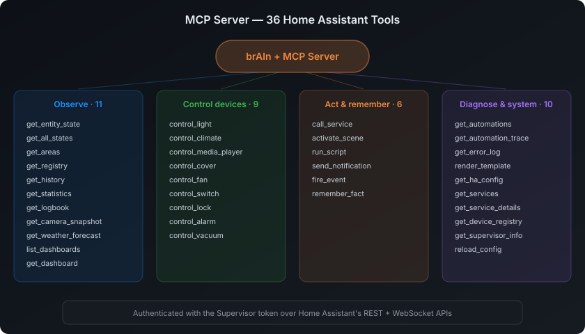
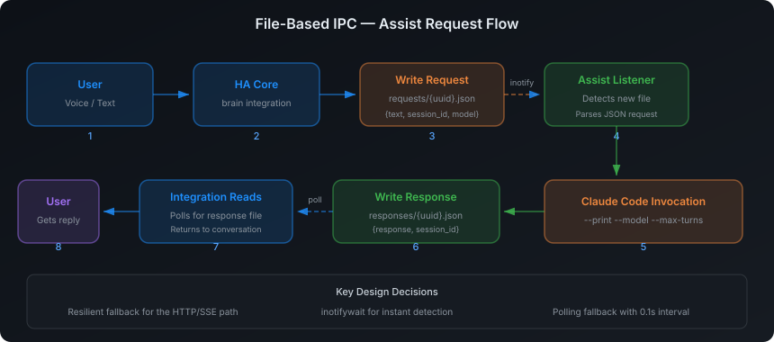

Everything you might need to look up. Configure from **Settings → Add-ons → brAIn → Configuration**. The defaults work out of the box; the tables below mirror `config.yaml` as shipped.

## Configuration options

**Seven of these are also editable from the panel's ⚙ Settings dialog**, which writes
them back through the Supervisor so both screens always show the same value:
`auto_refresh_hours`, `history_days`, `history_keep_runs`, `history_keep_days`,
`model`, `generation_timeout_minutes`, and **Let brAIn act without asking**
(`dangerously_skip_permissions`, in ⚙ → Terminal & chat). Everything else on this page is the
Configuration tab's alone.

⚙ Settings also holds things that are **not** add-on options at all, because they
are changed while looking at the panel rather than at a restart: the master pause,
your plan and usage budget, the Chat/Classic face, the chat's own model and how many
chats may run at once, `gather_mode`, `refresh_mode`, and the capture switch.

Onboarding's first screen asks for a notify service and quiet hours, which *are*
add-on options — and the panel cannot write those four
(`findings_notify_service`, `notify_quiet_start`, `notify_quiet_end`,
`morning_brief`). It stores your answer in its own settings instead and every
reader consults that as a **fallback under** the Supervisor's value, so the choice
takes effect immediately and **an entry on the Configuration tab always wins**.
The step tells you exactly what to paste there if you would rather keep it with
the rest of your options.

### Faces

| Option | Type | Default | Description |
| --- | --- | --- | --- |
| `enable_terminal` | bool | `true` | Run the ttyd terminal and expose the Terminal tab. Turn off for a dashboard-only install with no shell. |
| `enable_insights` | bool | `true` | Run the card scheduler and show the **Insights** pane. Off stops every scheduled Claude run; **Findings and Proposals stay**, because the house checks cost nothing and still file there. |

### Terminal

The **Chat / Classic** choice is not here — it lives in the panel's ⚙ Settings (and on
the Terminal tab itself), because it changes nothing about how the add-on runs.

| Option | Type | Default | Description |
| --- | --- | --- | --- |
| `auto_launch_claude` | bool | `true` | Start Claude Code automatically when the terminal opens. |
| `auto_generate_context` | bool | `true` | Regenerate `/config/CLAUDE.md` with your HA system context at startup. |
| `enable_ha_mcp_server` | bool | `true` | Give Claude native HA access (states, services, history, statistics, registries, dashboards, logs, templates). |
| `enable_mobile_ui` | bool | `true` | Splice the mobile toolbar and iOS dictation fix into ttyd's UI. |
| `dangerously_skip_permissions` | bool | `false` | **Let brAIn act without asking.** Off, the terminal and the chat ask before Claude runs a command, edits a file or changes something in Home Assistant; on, they stop asking. Same switch as ⚙ → Terminal & chat. See [below](#let-brain-act-without-asking). |

#### Let brAIn act without asking

The option's key is still `dangerously_skip_permissions`, so an existing setting keeps its meaning; its label is **Let brAIn act without asking**, and the same switch sits in ⚙ → Terminal & chat — flip either and the other follows.

- **Off (the default):** the terminal and the chat ask before Claude runs a command, edits a file or changes something in Home Assistant. Only reading is pre-approved. An approval card can offer **Always allow** for the rule Claude Code suggests, saying what it adds and for how long.
- **On:** both stop asking, and in the chat and the terminal the action gate stops asking its own model about what you meant.
- **Still guarded with it on:** brAIn's Home Assistant tools refuse your protected entities, and so do plain shell service calls and YAML edits made with Claude's file tools that name one. The tripwire, brAIn's own deny-list and your house rules still decide, and a conversation about a finding always asks before a change.
- **Not checked:** a shell command that reaches a protected entity some other way, and a change a shell command makes cannot be undone with `brain undo` (edits made with Claude's file tools can). If that matters to you, leave it off.
- **Never reaches** Fix it runs, voice or background runs — they keep their own rules.
- **No restart:** a new terminal session and the chat's next message pick it up. A terminal session already open keeps the setting it started with until you end it with `/exit`, and ⚙ says when one does. A setting brAIn cannot read counts as "ask", never as "go ahead".

### Voice and automation

| Option | Type | Default | Description |
| --- | --- | --- | --- |
| `enable_assist_integration` | bool | `true` | Register brAIn as a conversation agent for Assist. |
| `enable_automation_integration` | bool | `true` | Watch for task requests from automations. |
| `assist_fast_mode` | bool | `true` | Serve voice from a pool of pre-warmed persistent workers instead of spawning a CLI per request. |

**What a voice agent may reach is set on the agent, not here.** `assist_tool_access` and `assist_exposure` were removed in 2.10: each agent's **What this agent can reach** (Settings → Devices & services → brAIn → the agent → Configure) is *Voice assistant* (only what you expose to Assist, Home Assistant tools only — the default), *Whole house* (every entity, still no shell or file edits) or *Full admin* (everything the chat can do). An agent that used to follow the add-on is now a *Voice assistant*. See [Voice Assistant](/brain/voice/).

### Memory and learning

| Option | Type | Default | Description |
| --- | --- | --- | --- |
| `learning` | bool | `true` | Master switch for everything brAIn learns: the consolidator, the end-of-conversation reflection pass, the terminal and chat memory hook, and study sessions. Turning it off leaves existing memory untouched. |
| `memory_injection` | bool | `true` | Splice learned memory into voice prompts. |
| `memory_max_kb` | 1–64 | `32` | Size cap for the memory document. A pass that cannot fit under it files nothing, so this is the setting to raise when the log says the document is full. |
| `study_timeout_minutes` | 2–120 | `30` | Wall-clock limit for a study session. |
| `ask_why` | bool | `true` | Once a day at most, spend one Claude run working out **why** somebody did something by hand — running the sprinklers, pushing the heating up — and record it or put one short question on the Findings tab. Three a week at most, never twice about the same thing, and never about locks, alarms or where anybody is. |
| `findings_notify_service` | string | *(empty)* | A `notify.*` service (with or without the prefix) that gets a push when brAIn files a new finding. Empty means no notifications — the Findings feed, the sensor and the `brain_finding` event work either way. |
| `findings_notify_min_severity` | `info` \| `warning` \| `serious` \| `critical` | `critical` | Only findings at or above this severity are pushed. The default keeps your phone for what cannot wait — a leak, a freeze, a hub that has stopped answering, which are also the only ones brAIn reminds you about a second time. Everything else waits on the Findings feed, in your to-do list and in Repairs. Set it to `serious` for the old behaviour, where a dying battery is pushed once as well. |
| `notify_quiet_start` | string | `22` | The hour (0–23, your home's timezone) from which only urgent findings ring your phone. Everything else is held and delivered as one message when the quiet ends. |
| `notify_quiet_end` | string | `7` | The hour held findings are delivered. A window that crosses midnight (22 to 7) is the normal case. Set both the same, or both empty, for no quiet hours. |
| `morning_brief` | bool | `false` | One short message a day, at the hour your home actually starts moving, and only when there is something to say. Each one sent costs a Claude turn; a quiet morning costs nothing. Needs `findings_notify_service` set. |
| `morning_brief_hour` | string | `7` | When to send it until brAIn has measured your home's own hour (10 weekdays, so about two weeks), or if your days are too irregular for there to be one. |
| `weekly_report` | bool | `false` | One message a week: what the house used against the week before, what was found and answered, what brAIn learned, and the one thing worth doing. Needs `findings_notify_service` set — point it at `notify.notify` and it reaches everybody. |
| `weekly_report_day` | list | `sunday` | Which day it goes out. The hour is `morning_brief_hour`, or your home's own measured hour once brAIn knows it. |

### ESPHome

| Option | Type | Default | Description |
| --- | --- | --- | --- |
| `esphome_dashboard_url` | string | *(empty)* | Where your ESPHome dashboard is, when it is not the ESPHome add-on (which brAIn finds by itself) — e.g. `http://192.168.1.20:6052`. Editing device files never needs it; validating, compiling, installing and logs do. |
| `esphome_ha_token` | password | *(empty)* | A long-lived access token from a Home Assistant administrator, needed to build and install through the ESPHome add-on on a current Home Assistant: the Supervisor no longer lets one add-on open another's dashboard by itself. Used for that one thing only, and stored like every option, so it is in your backups. Not needed if you set the dashboard address above. |

There is no ESPHome or Music Assistant tab in the panel since 2.10 — ask in the chat or the terminal; the [tools](/brain/mcp/) are unchanged.

### Music Assistant

| Option | Type | Default | Description |
| --- | --- | --- | --- |
| `music_assistant_url` | string | *(empty)* | A Music Assistant server Home Assistant's integration is not connected to, e.g. `http://192.168.1.20:8095`. Leave empty to use the server Home Assistant uses, with its sign-in. |
| `music_assistant_token` | password | *(empty)* | A Music Assistant admin's long-lived token. Without it brAIn controls, configures and removes players and edits the library; with it, brAIn can also manage providers and server settings. It is in Home Assistant backups like every option, so use one you can revoke. |

> **What the terminal is told about your memory.** `auto_generate_context`
> writes `/config/CLAUDE.md` at startup, and the learned-memory document is
> excerpted into it — that is how the terminal and the chat know your house
> without asking. The excerpt is cut **between lines**, never mid-fact, and
> every `## ` section keeps at least its heading and its first line before any
> section gets a second one, so a long Preferences section can no longer push
> Device notes out of the file entirely. It takes 16 KB by default;
> `BRAIN_CONTEXT_MEMORY_BYTES` (an environment variable, not an option — set
> it in the add-on's own environment) raises or lowers that. An insight card
> is handed the whole document instead, up to `memory_max_kb`.

> **There are no turn limits on anything the panel runs.** `assist_max_turns`,
> `automation_max_turns` and `study_max_turns` were retired in 1.48.0, and 2.5.0
> took the caps off every run the panel starts — a card, a fix, the Resident's
> looks and investigations, triage, the brief, the weekly report — because one
> of them was binding: a structured reply the CLI validates against a schema is
> itself a turn, so the Resident's first look ran out of room, spent its tokens,
> filed nothing and wrote a fault into the next report. What bounds a run is the
> wall clock, which is the guard that actually answers "how much may this
> cost". The voice and automation listeners keep a guard of their own (40 and
> 200 turns) far past any real run, and a run that trips one is **landed**
> rather than truncated: it is resumed with two more turns and told to finish
> with what it has, in the format the task asked for, so a partial answer
> files instead of a thorough one that never did. A run the API refuses with
> *529 Overloaded* is tried once more after a pause, inside its own clock.
>
> What is left to reason about is the **wall clock**, which is the guard that
> actually bounds what a run costs: `study_timeout_minutes` for a study
> session and `generation_timeout_minutes` for a card.

### Insights

| Option | Type | Default | Description |
| --- | --- | --- | --- |
| `auto_refresh_hours` | 0–168 | `24` | How often recurring cards regenerate. `0` disables. |
| `history_days` | 1–30 | `7` | How much history each analysis reads. |
| `history_keep_runs` | 0–200 | `40` | Past runs kept per card. |
| `history_keep_days` | 0–365 | `30` | Age limit on past runs. |
| `model` | string | `""` | Override the Claude model. Empty uses the default. |
| `generation_timeout_minutes` | 2–30 | `8` | Per-generation timeout. |

### House checks and policy

| Option | Type | Default | Description |
| --- | --- | --- | --- |
| `checks_interval_hours` | 0–168 | `6` | How often the deterministic house checks run. They read Home Assistant and the Supervisor directly and never call Claude, so they cost nothing. `0` means never on a timer; `brain check` and the tab's button still run them. |
| `self_healing` | bool | `false` | Let brAIn make up to three repairs a night, inside your quiet hours: start an add-on that was set to run at boot, ping a dead Z-Wave node, reload an integration that failed to set up. Nothing else, never on a protected entity, and never on a finding you have already answered. See **The house acts**. |
| `protected_entities` | list | `[]` | Entity ids (`lock.front_door`) or whole domains (`alarm_control_panel.*`) that brAIn may never act on, from any face — the terminal, the chat, Fix it, voice, automations, insight runs and the overnight healer. Enforced at the one place every Home Assistant tool call passes through: a call aimed at an area or device containing one is refused, so is a label or floor target, a scene that names one in its `entities` map, and a scene, script or automation that references one. While the list is set, Claude may not call services from a shell, or write YAML that names one with its file tools. A switch shown as something else is protected if either half is. Protected entities can always be looked at. |

### Undo and access

| Option | Type | Default | Description |
| --- | --- | --- | --- |
| `edit_journal_days` | 0–365 | `14` | How long to keep snapshots of files Claude edited. **`0` really disables it** — nothing is snapshotted and nothing is indexed, so `brain undo` has nothing to restore. (Through 1.47.0 it only disabled the *prune*, which made the one setting that said off the one that made the journal unbounded.) |
| `access_share` | bool | `true` | Mount `/share`. |
| `access_media` | bool | `true` | Mount `/media`. |
| `access_backup` | bool | `true` | Mount `/backup` read-only. |
| `access_addon_configs` | bool | `true` | Mount other add-ons' config directories. |
| `access_addons` | bool | `true` | Mount add-on source directories. |
| `additional_directories` | list | `[]` | Extra paths to expose. |
| `persistent_apk_packages` | list | `[]` | Alpine packages reinstalled on every start. |
| `persistent_pip_packages` | list | `[]` | Python packages reinstalled on every start. |
| `log_level` | enum | `info` | Add-on log verbosity. At `debug` the panel logs every HTTP request (polls included) and ttyd its own connection chatter; below that a successful poll is silent and only failures are logged. |

## Recommended presets

### Quiet — terminal only

```yaml
enable_terminal: true
enable_insights: false
auto_launch_claude: true
auto_generate_context: true
enable_ha_mcp_server: true
enable_assist_integration: false
enable_automation_integration: false
learning: true
```

### Everything on

```yaml
enable_terminal: true
enable_insights: true
enable_ha_mcp_server: true
enable_assist_integration: true
assist_fast_mode: true
enable_automation_integration: true
study_timeout_minutes: 45
learning: true
findings_notify_service: notify.mobile_app_your_phone
morning_brief: true
weekly_report: true
protected_entities:
  - lock.front_door
  - alarm_control_panel.*
```

## The panel

One ingress panel on port **8099**, with four tabs. Each tab holds a few panes on a strip
under the bar:

| Tab | Pane | What it is | |
|-----|------|-----------|---|
| **Home** | **Findings** | Everything waiting on your decision — problems, guesses and suggestions — each with one row of answers | [Findings](/brain/findings/) |
| | **Insights** | Your cards and the ask bar; Refine and Share on every card | [Insights](/brain/insights/) |
| | **Ideas** | Cards brAIn thinks your house is missing | [Ideas](/brain/ideas/) |
| | **To-do** | Work you've accepted, plus anything you add | [Findings](/brain/findings/#the-to-do-list) |
| | **Proposals** | Changes brAIn would make, each with its evidence and a trial first | [Proposals](/brain/proposals/) |
| **Ask** | **Chat / Terminal** | Claude Code as a chat or a true terminal | [Terminal](/brain/terminal/) |
| **House** | **Knowledge** | What brAIn has measured about your house, and its memory | [Memory & Learning](/brain/memory/) |
| | **Activity** | What happened in the house and what caused it | [Activity](/brain/activity/) |
| | **Upkeep** | Tidy names and rooms, should-I-update-tonight, the overnight check and the house book | [Upkeep](/brain/upkeep/) |
| **Help** | **Docs** | The same guide, shipped inside the add-on and searchable offline | |

ESPHome and Music Assistant have no pane since 2.10 — both have their own screens, and
everything brAIn did there is one sentence away in the chat or the terminal.

A number on **Home** means something is waiting on your decision. **To-do** has its own
count; nothing else carries a badge, because nothing else waits on you.

### Panel settings

These live in the panel's **⚙ Settings** dialog, not the add-on Configuration tab, and take
effect without a restart. Anything left unset falls back to the add-on option of the same
name.

| Setting | Values | What it does |
|---------|--------|--------------|
| `auto_enabled` | on / off | Master pause for all *scheduled* work. Manual presses always run. |
| `plan` | `pro`, `max5`, `max20` | Which Claude plan you're on — only used to estimate a session window when there's no real utilisation to read. |
| `budget_percent` | 5–100 (default 25) | How much of each 5-hour session window scheduled work may spend. |
| `terminal_ui` | `chat`, `classic` | Which face the Terminal tab opens in. Default `chat`. |
| `model` | preset or a custom model id | The model insight generation uses. |
| `chat_model` | a model id, or unset | The chat terminal's own model, picked **from the chat** (the model name under the composer, or ⋯ → Model). Unset follows the global `model` — and deliberately never writes it, which would silently change what every insight run costs. |
| `chat_max_sessions` | 1–8 (default 3) | How many chat conversations keep a live Claude Code process. It counts **processes, not conversations** — you may have as many of those as you like. Past it, the session untouched for longest is closed (never one mid-answer) and reopens where it left off. |
| `capture` | on / off (default off) | **Records what the analyst was sent and what it answered**, one file per card run under `/data/capture`, plus the ending you later gave each finding it raised. Off by default because your entity and area names are a floor plan; nothing leaves the add-on until you press **Export**. [Capture & the Corpus](/brain/corpus/) |
| `gather_mode` | `search`, `snapshot` | **How a card gets its data.** `search` (default) sends Claude a *map* of the home plus read-only HA tools, so it looks up only what the card needs — and it's the only mode that can afford history on a typed question. `snapshot` is the old send-everything path, kept as a setting and as the automatic fallback when a search run fails. |
| `refresh_hours`, `history_days`, `history_keep_runs`, `history_keep_days`, `timeout_minutes` | | Same meaning as the add-on options below. |

### Token budget

`budget_percent` caps how much of each 5-hour session window brAIn may spend on **scheduled**
work; automatic runs pause at the budget, manual presses never do. The meter uses your **real
Anthropic account utilisation** from the usage-limits tracker, so brAIn backs off when *you*
are using Claude elsewhere.

The topbar pill keeps both windows in view — `Session 19% · Week 46%`. **Press it** for the
reset times and what the budget gates; it's a press rather than a hover because a tooltip is
unreadable on the device where that pill matters most. Only the session is budgeted against;
the week is shown because a session that looks fine says nothing about a week that doesn't.
Neither number exists without a subscription login, so with an API key the session falls back
to an estimate of brAIn's own spending and the week isn't shown at all.

## Voice assistant (Assist)

Select **brAIn** as a conversation agent in **Settings → Voice Assistants**. Each agent has its own name, model, personality, reach (*Voice assistant*, *Whole house* or *Full admin*) and Blocked services list — new agents start with the administration services (restarts, host shutdown, `update.install`, `recorder.purge`, `shell_command.*`, `backup.create` and the `brain.*` registry tools) already ticked. A *Voice assistant* agent may only use an entity's own services on entities you expose, so it cannot restart Home Assistant or create a login however a sentence is misheard. New agents default to Claude Haiku (`Default` inherits the terminal's model); `brain.clear_conversation` resets conversation memory (omit `conversation_id` to reset all). How it works — fast mode, the area map, personalities: [Voice Assistant](/brain/voice/).

## Insight jobs

Scheduled reports rendered to **sensors**, created from **Settings → Devices & Services → brAIn → Add Service → Insight job**. The report lands in the sensor's attributes: `preview` (first lines), `markdown` (full report), `card_yaml` (ready-to-paste card). A `brain_insight_complete` event fires after every run with `name`, `entity_id`, `success`, and `preview`. Templates, scheduling, and dashboard recipes: [Automations & Insight Jobs](/brain/automations/#insight-jobs).

## HA services

```yaml
# Send a prompt and wait for the response
action: brain.send_prompt
data:
  prompt: "What entities are offline?"
  timeout: 120
  model: haiku        # optional per-call override

# Run a task in the background, with optional notification
action: brain.run_task
data:
  prompt: "Check today's error log and summarise the issues"
  notify: true
  notify_entity: notify.mobile_app_phone   # where the notification goes; omit for a persistent notification
  model: haiku        # optional per-call override
  timeout: 300
  tools: read_only    # full (default) | house | read_only

# Run one or all insight jobs now
action: brain.run_insight
data:
  name: "Daily Briefing"   # omit to run all

# Do one thing next time. Returns immediately; the card lands on Proposals.
action: brain.intent
data:
  sentence: "Turn the porch light off when the guests leave"

# Study the home. Returns immediately; results arrive in memory.
action: brain.study
data:
  topic: "energy"          # omit to study whatever has gone stalest

# Teach it something durable
action: brain.add_memory
data:
  fact: "The garage fridge is meant to run 24/7"
  confidence: high         # high | medium | low
  source: "spouse"         # optional — where the fact came from (default "service")

# Answer one of brAIn's open guesses — the same as Yes or No on the Findings tab
action: brain.answer_question
data:
  question: "Is the garage fridge meant to run 24/7?"   # or ts: <id from the Waiting on you sensor>
  answer: "Yes, it holds the overflow from the kitchen."  # must start with yes or no

# Ask a question and get the answer as DATA an automation can branch on
action: brain.ask
data:
  question: "Which rooms are below 18 °C right now?"
  schema:                    # optional — the shape the answer must fit
    type: object
    properties:
      rooms: { type: array, items: { type: string } }
    required: [rooms]
  tools: read_only           # read_only (default) | house | full
response_variable: cold      # cold.data.rooms is a list

# Put something on the to-do list (the same list as todo.brain_system_brain)
action: brain.add_todo
data:
  text: "Replace the hallway smoke alarm battery"

# Run the house checks now instead of waiting for the next pass
# (also the "Run house checks" button on the brAIn System device)
action: brain.check

# Reset conversation memory
action: brain.clear_conversation
# data: { conversation_id: "..." }   # omit to clear all
```

`brain.ask` returns `response` (text) and, when you pass a `schema`, `data` — the object
Claude produced, validated against that schema before it was returned. It's read-only unless
you say otherwise, because a question isn't a change. `brain.run_task` accepts a `schema`
too.

**These eleven are brAIn's own services.** The powerful ones need a Home Assistant
administrator: `brain.run_task` and `brain.ask` with `tools` wider than `read_only`,
and `brain.add_memory`, `brain.study`, `brain.intent` and `brain.answer_question`
(what they file is read by every later run). `brain.send_prompt` does not, because it
is the voice level Assist already gives any user. A task that failed — an expired
sign-in, a timeout — **raises an error** naming the reason rather than handing your
automation an apology as if it were the answer.

`brain.answer_question` closes the guess exactly as the Findings tab's Yes or No does:
a yes files it as something brAIn knows, a no closes it, and anything after the no is
kept as a correction. The open guesses and their ids are on the **Waiting on you**
sensor; an answer that does not start with yes or no is refused.

`brain.intent` queues the sentence and returns straight away, and what comes back is a card
on the Proposals tab — a one-off, or a standing rule simulated against your history — including
when brAIn will not arm it. Nothing is written until you accept it. See
[Rules & one-offs](/brain/intents/).

Plus the **69 [Power Tools](/brain/power-tools/)** services for registry administration — including, since 2.11, the four that change [what a device shows as](/brain/power-tools/entities/#what-a-device-shows-as) (`set_device_class`, `show_switch_as`, `stop_showing_switch_as`, `set_sensor_display`).

## Sensors

### Learning sensors

| Entity | Reports |
|--------|---------|
| `sensor.brain_memory_facts_learned` | How many things brAIn knows |
| `sensor.brain_memory_last_learned` | The most recent fact, with the text as an attribute |
| `binary_sensor.brain_memory_waiting_on_you` | On when a guess needs a yes/no, with the text in `pending` |

A **`brain_learned`** logbook event fires for every new fact, so learning appears in your home's timeline next to lights and doors — see [Events](#events).

### Findings sensor

`sensor.brain_findings_open_findings` exists to be *automatable* — the panel's badge answers the same question, but a badge cannot ring a phone at a sensible hour or sit on a dashboard. State is the open count; attributes carry the severity split (`critical` / `serious` / `warning` / `info`), the finding texts (first 20), and `newest`, because an automation that only knows "3" cannot put what is actually broken on a lock screen. It reads the mirror the add-on republishes to `/config/.brain/findings_state.json` on every findings change, and stays **unavailable until the add-on has written one** — which is what tells a fresh install apart from a clean bill of health.

### Usage-limit sensors

Your real Anthropic account utilization — the same numbers as **claude.ai → Settings → Usage**, not estimates. A background tracker asks Anthropic's usage endpoint shortly after each Claude run finishes — the only moment the numbers can have moved — and otherwise every **30 minutes**; the sensors read the tracker's file every 30 seconds.

| Sensor | Tracks | Key attributes |
|--------|--------|----------------|
| Session Usage | Percent of the current 5-hour session window used | `resets_at`, `data_source`, `last_updated` |
| Session Usage Resets At | When the 5-hour window resets | `utilization` |
| Weekly Usage | Percent of the rolling 7-day window used | `resets_at`, `data_source`, `last_updated` |
| Weekly Usage Resets At | When the 7-day window resets | `utilization` |

:::caution
These need an **OAuth / subscription login**, **not** an `ANTHROPIC_API_KEY`. With an API key — or before you've signed in — they stay **unavailable**. And during a streak of 429s from the usage endpoint the four sensors **will go unavailable by design**: the tracker's backoff (1, then 2, then 4 hours) deliberately exceeds the two-hour window after which a reading is too old to trust, because retrying a rate-limited endpoint is what sustains the limit. Either way, the reason lives on the **Usage tracker** diagnostic sensor below — HA hides the attributes of an unavailable entity, which is exactly why the explanation lives somewhere that never goes unavailable. `brain doctor` reports this too.
:::

### Usage tracker diagnostic sensor

The **Usage tracker** sensor's whole job is to be readable when the four above are not, so it **never goes unavailable**. Its state is `ok`, or the reason the others can't be: `no_oauth_token`, `api_key_has_no_usage_limits` (an API key bills per token and has no subscription window — that's a different situation, not a failed sign-in), `http_401`, `http_429` (with a `detail` attribute saying this is the *endpoint's* rate limit, not your account's usage), `network_error`, `stale`, or `not_running`. A failed poll records `last_error` and `next_attempt_at` *beside* the reading it deliberately left showing — so the moment the numbers blank, the diagnostic names the cause instead of saying `stale` and nothing else.

### Health sensors

`sensor.brain_usage_limits_health` (the **Health** sensor) is brAIn's verdict on itself — `ok`, `degraded` or `failed` — with the reason and the switch to look at as attributes. It never goes unavailable: if the add-on has stopped publishing, that *is* the state. While it is not `ok`, Home Assistant's **Repairs** carries the reason too. A credential merely waiting for its next refresh is not a fault and does not degrade it.

`binary_sensor.brain_system_assist_healthy` reports voice-assistant pool health, with worker count, the pre-warmed spare, and last-request latency as attributes.

### House sensor

`sensor.brain_house` is what brAIn thinks the house is doing right now. Its state is the mode — `home`, `away`, `asleep`, `waking`, `guests`, or `unknown` when it cannot tell — and its attributes are `sentence`, `rooms_in_use`, `unusual_together`, `because`, `coming_up` and `published_age_minutes`. It is refreshed every few minutes and never goes unavailable: a reading that is missing or stale is `unknown` with a `reason` attribute, so an automation keyed on it never acts on how the house looked an hour ago. It is context for brAIn's own looks, and a wrong *away* can never make a leak alarm or a protected device any less important.

### Buttons, AI Task and other entities

| Entity | What it is |
|--------|-----------|
| `button.brain_system_run_house_checks` | **Run house checks** — the same as `brain.check` |
| *Run now* button, one per insight job | Runs that job now |
| `ai_task.brain_system_ai_task` | brAIn as Home Assistant's **AI Task** entity (Home Assistant 2025.7 and later): `ai_task.generate_data` gets a read-only answer, checked against the structure you asked for before it is returned |
| `sensor.<job>_insight` | One per insight job — see [Insight jobs](#insight-jobs) |

On Home Assistant versions that support it, other assistants can also ask brAIn what it has measured — what is normal for an entity, what it remembers, what caused a change — through Home Assistant's own LLM API, limited to what you expose to them.

### To-do list

`todo.brain_system_brain` is brAIn's to-do list in Home Assistant's own To-do panel and app: the open findings brAIn is asking about, the findings you've accepted as work, and anything added with `brain.add_todo` or typed in the app. Ticking a finding off is the same as **I've fixed it**, deleting it the same as **Wrong**; ticking a chore off is the same as **Done** on the panel's To-do tab.

Findings waiting on you also appear in Home Assistant's **Repairs**, with the same buttons as the card.

## Events

| Event | Fires | Payload |
|-------|-------|---------|
| `brain_finding` | Once per **newly-filed** finding — never for a re-report, because the store dedupes across every status and the settled ledger | `finding`, `severity`, `entity_id`, `fixable`, `source`, `ts` |
| `brain_learned` | Once per fact filed into memory (and once per forget) | `fact`, `source` |
| `brain_insight_complete` | After every insight-job run | `name`, `entity_id`, `success`, `preview` |
| `brain_case` | When something new needs a decision on the Findings tab — a problem, a guess or a suggestion | the case: `kind`, `title`, `severity`, `answers`, … |
| `brain_case_ended` | When a case leaves the feed — answered, cleared by its check, or moved to the to-do list | the case, and how it ended |
| `brain_change` | When brAIn changed something in your house (a fix was applied) | the case, and what changed |

`brain_finding` still fires beside `brain_case`, so automations written against it keep working. A Dismiss is not an ending — a snoozed case fires no `brain_case_ended` and comes back without a new `brain_case`. The first two also carry `name` and `message` fields phrased as sentences, so they read properly in the **logbook** — learning and findings appear in your home's timeline next to lights and doors. `brain_finding` is what to trigger on for anything fancier than the built-in push (`findings_notify_service` covers the simple case with no automation at all).

## MCP server tools

The built-in MCP server gives Claude **89 tools** against your live install — including `get_registry` (areas, floors, labels, devices, entities, integrations, users — entity rows say what a device shows as), `call_service` with `return_response` for the [Power Tools](/brain/power-tools/) workflow, the measurement tools, live automation traces, and tools for BRUH Minecraft, BRUH Print and BRight. Verify them on your own system with **`brain doctor`**. Full tool-by-tool reference: [MCP Tools](/brain/mcp/).



## CLI

Two dispatchers in the terminal — `brain` for brAIn's own faculties, `ha` for Home Assistant operations. `brain help` and `ha help` list everything; the full tables are on [The CLI](/brain/cli/).

```bash
brain memory list        brain learn energy      brain undo      brain doctor
ha log                   ha reload automations   ha check        ha context
```

`brain doctor` is free and never calls Claude. Two costed checks sit beside it and neither
ever runs on a timer: **`brain doctor --deep`** walks every face of the add-on with one real
round trip each (about five Claude turns), and **`brain doctor --rehearse`** plants a few
`brain_test_*` defects in your house, scores the checks and the analyst against them, and
removes everything — asking first, and naming exactly what it would create. Both are also
buttons in **⚙ Settings → Diagnostics**. [Deep Check & Rehearsal](/brain/doctor/).

## Undo

brAIn **does not back up your configuration.** Home Assistant's own backups are whole-system and restorable, and versioning `/config` inside `/config` only made those backups bigger.

What it keeps instead is an **edit journal**: before Claude writes to any file under `/config`, the previous contents are snapshotted to `/data/.brain/edits/`.

```bash
brain undo                # list recent edits, newest first
brain undo 3              # revert edit #3
brain undo --all-today    # revert everything Claude changed today
```

Snapshots are pruned after `edit_journal_days` and capped by total size. A [Fix it](/brain/findings/) change has its own **Undo** on the card, which puts back the files it edited and lists the service calls it made, each with a separate press to restore the state before it. **`secrets.yaml` is never snapshotted.** An existing `/config/.git` directory from an older add-on is left strictly alone — brAIn never writes to it; delete it yourself if you don't want it.

## File ownership

Home Assistant saves `automations.yaml`, `scripts.yaml` and `scenes.yaml` as root, which used to leave them read-only for Claude. Since 2.11 **brAIn hands them back by itself** — at startup, before Claude edits a file it cannot write or runs a command that names one, and about once a minute for the files the editors rewrite — across `/config`, `/addon_configs`, `/share`, `/media` and `/addons` while each is mounted. Claude is told never to ask you for `sudo` or `chown`. `brain own <path…>` (or `brain own -r <folder…>`) does the same on demand and never touches `.storage`, `.cloud`, brAIn's credentials, `secrets.yaml` or the recorder database.

## Transport & health

In fast mode the worker pool serves an internal HTTP API on **port 8098** (the panel owns 8099), token-authenticated via the shared `/config` volume. The integration prefers it — no file polling, and replies stream so TTS starts at the first sentence. If the API is ever unreachable, both sides fall back to the original file protocol automatically. Nothing hardcodes the port; the integration reads it from the endpoint file the pool publishes.

`/api/health` — the endpoint the Supervisor watchdog polls — also calls the roll: it reports which background daemons are actually running (worker pool, listeners, usage tracker, memory consolidator, study watcher, ttyd) and when the last consolidation pass landed. That part is **informational only**, on purpose: a dead sibling can never fail liveness, or the watchdog would restart-loop the whole add-on over one daemon. `brain doctor` reads it and compares it against its own view.

### Diagnostics endpoints

All on the ingress panel (8099), all reachable from the terminal over loopback.

| Route | What it does |
|-------|--------------|
| `GET /api/diagnostics` | The whole bundle: versions, options, the run journal's last day, store counts, the health verdict, which checks could not run and why, the last deep check and rehearsal, the shadow-mode lines, and the capture counts. No prompts, no replies, no entity states. Same payload as the mirror at `/config/.brain/diagnostics.json` and as HA's own **Download diagnostics** button |
| `POST /api/doctor/deep` | Start a deep check. A second caller gets the run that is already going rather than a collision |
| `GET /api/doctor/deep` | The stages as they land, and the last run's verdict |
| `POST /api/doctor/rehearse` | Start a rehearsal. **Without `{"consent": true}` it answers `428`** carrying the exact list of what it would create, and writes nothing |
| `GET /api/doctor/rehearse` | The rehearsal's progress and last scores |
| `GET /api/capture` | One row per captured run: when, what, how many findings, how many endings label them |
| `GET /api/capture/{run id}` | One whole capture, exactly as it is on disk |
| `POST /api/capture/{run id}/export` | Copy that one capture to `/share/brain/corpus/` |
| `DELETE /api/capture/{run id}` | Remove it |



## Permissions architecture

| Channel | Mechanism | Default access |
|---------|-----------|----------------|
| Interactive terminal and chat | Prompts for anything but reading, plus the action gate (unless **Let brAIn act without asking** is on) | Everything — you approve actions |
| Voice / conversation agents | The agent's reach (*Voice assistant*, *Whole house*, *Full admin*) + its Blocked services | *Voice assistant*: exposed entities, their own services, HA tools only |
| Automation tasks | The task's `tools` (`full`, `house`, `read_only`) — wider than `read_only` needs an administrator | `full`: MCP, shell, file edits, web |
| Card rendering (snapshot mode) | `--disallowedTools "*"` | **No tools at all** — it renders what it was handed |
| The analyst — insight runs, study sessions, typed questions | Explicit allow-list **and** explicit deny-list, checked from both ends in CI | **Read-only** HA tools; nothing that can change the house |
| **Fix it** | A read-only plan first; **Apply** carries out exactly those steps, most of them by the panel itself, and any Claude run is held to the approved change — never on a schedule | Only what you approved |

The last three are the panel's three Claude paths, and only one can change the house. The analyst runs unattended, so its tool set is asserted from both ends rather than trusting one flag: `--allowedTools` only governs what runs *without a prompt*, and a headless run can't be prompted, so an un-listed tool merely **fails** rather than being **forbidden** — not the same guarantee with a real house behind it. The deny-list is checked against the MCP server's own tool names in CI, so a newly added acting tool fails the build instead of quietly reaching an unattended run.

Background channels never use `--dangerously-skip-permissions` — they can't prompt, so their pre-approvals live in a separate headless settings file. `/config/.claude/settings.local.json`, which the terminal and the chat read, pre-approves only reading Home Assistant. An action gate stands in front of every acting call in the chat and the terminal, decided from your own words and never from anything brAIn read; your `protected_entities` and house rules apply beneath it. Everything runs sandboxed as a non-root user (UID 1000), limited to `/config`, `/data`, and the enabled volume toggles.

## Ports

| Port | What | Needed? |
|------|------|---------|
| 8099 | The ingress panel. Also reverse-proxies `/terminal/`. | Internal; ingress handles it. |
| 7681 | ttyd, direct access. | **Unpublished by default** — declared as `null`, so nothing on your LAN can reach it until you assign a port in the add-on's **Network** panel (handy for a kiosk or a bookmarked full-screen terminal). |
| 8098 | The assist worker pool's internal API. | Internal only. |

A published terminal port answers the LAN with no Home Assistant login in front of it — the exposure HA documented in [GHSA-gh5m-4m97-c95h](https://github.com/home-assistant/core/security/advisories/GHSA-gh5m-4m97-c95h) — which is why 7681 ships off. ttyd also **always requires HTTP Basic auth** now, published or not: user `brain`, password generated into `/data/terminal-credential` and printed in the add-on log. The panel presents that credential upstream on every proxied request, so anyone coming in through ingress never sees a prompt.

## Where data lives

| Path | Contents |
|------|----------|
| `/config/CLAUDE.md` | Auto-generated install context |
| `/config/.brain/memory/memory.md` | **The memory document** — plain markdown, yours to edit |
| `/config/.brain/memory/voice.md` | The ≤2 KB distillate spliced into voice prompts (derived) |
| `/config/.brain/memory/inbox/` | Candidate facts awaiting consolidation |
| `/config/.brain/` | IPC bridge — request/response queues, sessions, logs |
| `/config/.brain/usage_limits.json` | Cached account utilization for the sensors |
| `/config/.brain/situation.json` | What the house is doing now — what `sensor.brain_house` reads |
| `/config/.brain/findings_state.json` | The findings mirror — derived, republished on every change; what the sensor, event, and push read (`/data` is invisible to HA, which is why it exists) |
| `/config/.brain/logs/{assist,automation}-YYYYMMDD.log` | Per-request debug logs |
| `/config/custom_components/brain/` | The HA integration |
| `/data/findings.json` | The findings work list itself (the mirror above is derived from it, never read back) |
| `/data/chat/` | The chat tab's scrollback, one file per conversation — capped, and only a scrollback: Claude Code owns the real conversation, so losing it never costs context |
| `/data/chat-trash/` | Deleted chat conversations, where the toast's Undo restores from (TTL'd and capped) |
| `/data/capture/` | Captured analyst runs, when `capture` is on — redacted as they are written, capped at the newest 50, and named in `backup_exclude` |
| `/share/brain/corpus/` | Where **Export** copies one capture, so the file editor and Samba can reach it. The only route out of the add-on |
| `/share/brain/reports/` | The redacted bundle `brain report` writes |
| `/data/terminal-credential` | ttyd's generated Basic-auth password |
| `/data/run-sources.jsonl` | Which face (voice, consolidator, study, chat…) started each conversation — what keeps machine runs out of your Chats rail |
| `/data/.brain/edits/` | The edit journal `brain undo` restores from |
| `/data/` (add-on volume) | OAuth credentials, persistent packages |

## Dashboard cards

Any insight can be put on a dashboard from its **↗ Share** button: pick the dashboard and
view, and brAIn adds the card itself. For a dashboard kept in YAML, the same dialog gives you
the YAML to paste:

```yaml
type: iframe
url: /local/brain/energy-<your-card-token>.card.html   # or .html for just the chart
aspect_ratio: 110%
```

Insight HTML is mirrored into `/config/www/brain/`, where Home Assistant itself serves it at `/local/…` — same origin as every dashboard, so cards work on HTTP, HTTPS, and Nabu Casa alike with no port mapping. Each card has two files: `…card.html` (the whole card — heading, answer, numbers and chart, with the chart in a sandboxed frame) and `….html` (the chart alone, which is what dashboard cards made before 2.8 point at). The card always shows the latest run and reloads every 15 minutes. The card token is a per-install random secret embedded in the file name; the mirror holds *only* insight HTML — no API, no credentials, no controls. Anyone with the exact URL can view that insight, so treat the token like any dashboard-level secret.

## Privacy & security

- Home data is sent to Anthropic's API only when you ask for something or a run you scheduled fires; nothing else leaves your machine.
- Person **GPS coordinates are never included** in snapshots — only zone/state and areas.
- Generated visualizations render in **sandboxed iframes** (`sandbox="allow-scripts"`) — they cannot touch your HA session, cookies, or the panel.
- The panel is reachable only through **HA Ingress** (admin users); the terminal port ships [unpublished and password-protected](#ports).
- An **AppArmor profile** confines the container. It doesn't enumerate permitted binaries — brAIn runs an agent, and that list would break the first time you asked for something new — it denies the **host-escape set** instead: no mounting, no kernel modules, no raw sockets, no kernel tunables, no Docker socket, no ptracing out of the profile. brAIn rates **6/6** on the add-on store's security scale.
- **The Claude credential never rides into your backups.** HA backups are unencrypted unless you opt in, then get copied to cloud storage, NAS shares and support tickets — so `backup_exclude` keeps the OAuth credential, the terminal password, and the chat scrollback out of them. Restoring a backup costs you one sign-in.
- `secrets.yaml` is never snapshotted into the edit journal, and credentials are never read, written, or included in any snapshot.

## Mobile

The whole panel is built for a phone, not just shrunk to fit one: every tab and button is at
least 44px, no width collapses the tabs into a row of bare glyphs, and no text control is
under 16px (below that, iOS Safari zooms in on focus and never zooms back out, which strands
an ingress panel at an arbitrary scale).

The **Terminal** tab folds the top bar away while the software keyboard is up and restores it
when you dismiss it; **⤢** folds it away for good and brings it back.

In the terminal's **Classic** face, a one-tap toolbar sits above the keyboard:

- **21 keys** — `ESC`, `▾ Kbd`, `Tab`, `⇧Tab`, the four arrows, `PgUp`, `PgDn`, `^C`, `^D`,
  `^L`, `^U`, `/`, `@`, `#`, `!`, `|`, `Paste`, `×`. No sticky modifiers.
- **Swipe to scroll** — one-finger up/down (or the wheel on desktop) is translated to
  PgUp/PgDn proportionally, so long-press text selection still works.
- **Copying works** — OSC 52 clipboard sequences are intercepted and buffered across
  WebSocket frames, which is what lets you copy an OAuth URL out of the terminal on iOS.
- **Add to Home Screen** for a full-screen launcher without Safari chrome.
- **Voice dictation:** turn off iOS **Voice Control** (Settings → Accessibility) to avoid
  double-submission.
- Disable the whole classic-terminal toolbar with `enable_mobile_ui: false`.

## When to restart Home Assistant

| Scenario | Restart? |
|----------|----------|
| First install | **Yes** — HA must load the new custom component |
| Add-on version upgrade | **Yes** — updated Python files need reloading (a notification + repair appear) |
| Add-on restart, same version | No |
| Config option changes | No — read at add-on boot |

:::tip[Update not showing up?]
The Supervisor only re-pulls add-on repositories periodically. To pick up a fresh release immediately: **Add-on Store → ⋮ → Check for updates**.
:::

## Troubleshooting

| Symptom | Fix |
|---------|-----|
| Add-on won't start | Check the **Log** tab. Usually an architecture mismatch — the add-on builds for `amd64` and `aarch64` only. |
| Integration not discovered | Restart HA after the first add-on start. Add manually via **Settings → Devices & Services** if needed. |
| The panel says you are signed out, but the terminal works fine | Fixed in **1.47**. Before it, brAIn read the Claude CLI's short-lived access token as a dead credential a few hours after every terminal sign-in, put up the sign-in screen, and then never ran the CLI — which was the one thing that would have renewed it. **The workaround on an older version:** open the Terminal tab and run any `claude` command. That renews the token and clears the verdict. |
| The terminal asks for a second login | One credential is shared with the CLI in both directions; if it doesn't take, `brain doctor`'s auth check names the file it found and the one it expected. |
| It can't see entities | `enable_ha_mcp_server: true`? Run **`brain doctor`** — it reports any tool that errors. |
| Voice can't see or control a device | It isn't exposed to Assist — **Settings → Voice assistants → Expose**, or set that agent's reach to *Whole house* (brAIn → the agent → Configure). |
| Claude says it can't write `automations.yaml` | Shouldn't happen since 2.11 — brAIn hands files back by itself. Run `brain own /config/automations.yaml`; the startup log says how many files changed hands. |
| Voice agent answers wrong room | Run `brain doctor` — the "Assist area map" check confirms the room map is built. |
| A study session produced nothing | It probably hit `study_timeout_minutes`; the log says so. Raise it. |
| Cards look thin | The card found few matching entities — check areas are assigned and the relevant sensors enabled in HA. |
| Generation timed out | Raise `generation_timeout_minutes`, or set a faster `model`. |
| Usage sensors *unavailable* | Read the **Usage tracker** sensor's *state* — HA hides an unavailable entity's attributes, which is exactly why the reason lives in a sensor that never goes unavailable. `no_oauth_token` means sign in (an API key isn't one, see above); `http_429` means the tracker is waiting out the endpoint's rate limit and `next_attempt_at` says until when. |
| New findings never reach my phone | `findings_notify_service` is unset (it defaults to off), or the finding is below `findings_notify_min_severity` (default `critical` — set it to `serious` to be told about dying batteries too). The Findings tab and `brain_finding` event carry everything regardless. |
| Anything else | **Settings → Add-ons → brAIn → Log**, with `log_level: debug`. |

### Per-request debug logs

Every Assist and automation request is logged with channel, prompt size, model, the speed path it took (`warm`/`spare`/`cold`/`…+fallback`), duration, and a response preview.

```bash
tail -f /config/.brain/logs/assist-$(date +%Y%m%d).log
tail -f /config/.brain/logs/automation-$(date +%Y%m%d).log
```

Set `log_level: debug` in the add-on config before reproducing a bug for maximum detail.

## Disclaimer

brAIn is an independent project, not affiliated with, endorsed by, or sponsored by Anthropic. "Claude" and "Claude Code" are trademarks of Anthropic, PBC. The add-on runs the official Claude Code CLI under your own Anthropic account; your use of Claude through it is governed by [Anthropic's terms](https://www.anthropic.com/legal/consumer-terms).
