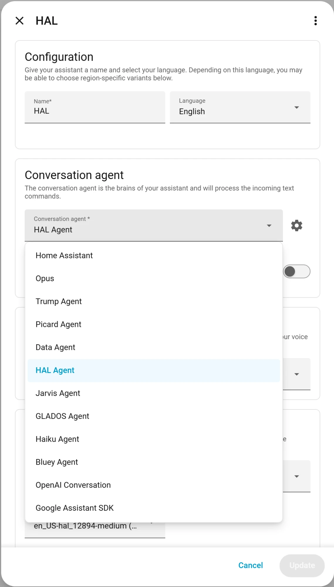

Pick **brAIn** as a conversation agent under **Settings → Voice Assistants** and every Assist pipeline — voice satellites, the chat dialog, the mobile app — routes through Claude with full knowledge of your home.

## Why it's fast

Typical commands answer in **~3–5 seconds**, and replies **stream**, so TTS starts speaking at the first sentence on streaming-capable pipelines. Each message streams as its own paragraph, so "I'll check." and the answer after it no longer arrive glued together in the chat log. Two mechanisms:

- **Fast mode** (`assist_fast_mode`, default on): a pool of pre-warmed Claude worker processes — one per active conversation plus a hot spare — so voice turns skip CLI boot and MCP handshake entirely. Budget ~150–300 MB RAM per warm worker (max 3). If a worker errors *before* it has touched anything, the add-on falls back to a one-shot run automatically.
- **The area map**: a cached area → entity map (controllable domains plus Weather and People) is spliced into the system prompt, so *"turn off the kitchen lights"* acts directly — no lookup turns. A voice-level agent's map only holds what you've exposed to Assist.

Voice agents are also sent only the tools they could actually use, and the ones they act with are loaded up front, so a command can act on its first turn.

`binary_sensor.brain_system_assist_healthy` reports pool health (worker count, spare, last-request latency, failed turns by kind), and `brain doctor` probes the whole path end-to-end. Every voice turn is in brAIn's run journal, failures included, and the usage figure refreshes after one.

## Personalities

Each conversation agent you create gets its own **name, model, system prompt and reach** — a butler, a snarky roommate, a kid-friendly narrator. Prompts are layered deliberately:

1. **Your personality** leads, and explicitly owns identity, tone, and verbosity.
2. An **operational block** follows — tools, the area map, timezone, routing rules, and what this agent is allowed to reach — deliberately identity-free so it can't fight your persona.



Without a personality, a built-in default applies ("helpful, efficient, 1–2 short sentences"). With one, that default is dropped entirely — so if your persona should stay brief for TTS, say so in the persona: *"…no matter how excited you get, keep spoken replies under two sentences."*

New agents default to **Claude Haiku** for snappy responses; pick any model per agent in the integration options. An agent set to **Default** runs on brAIn's own voice model and thinking depth.

You can run several at once, each with its own name, model, personality, reach and blocked services:

```text title="Two agents, one house"
"Jarvis"        You are Jarvis, a dry British butler. Address me as "sir".
                However excited you get, keep spoken replies under two sentences.
                Reach: Full admin. Blocked: nothing.

"Kids' speaker" You are a cheerful helper for a 7-year-old. Short, simple words.
                Never mention alarms or locks; if asked, say you'll fetch a grown-up.
                Reach: Voice assistant.
                Blocked: lock.unlock, lock.open, alarm_control_panel.*, script.*
```

Because voice reads the same [memory](/brain/memory/) as everything else, an agent already
knows the house it's talking about:

> **"Turn on the beacon."** → memory says the beacon is the office lamp.
>
> **"It's too cold in here."** → memory says the heating is a heat pump on weather
> compensation, not a boiler, so it raises the flow temperature instead of asking for a
> target temperature that would do nothing.

## What each agent can reach

Every agent chooses **What this agent can reach** — when you add it (Settings → Devices &
services → brAIn → **Add service**), and later under that agent's **Configure**:

| Level | Sees | Can use |
| --- | --- | --- |
| **Voice assistant** (new agents) | Only what you expose to Assist | Home Assistant tools only |
| **Whole house** | Every entity | Home Assistant tools only |
| **Full admin** | Every entity | Everything the brAIn chat can: shell, file edits, config, the web |

So the kitchen speaker anybody can talk to stays a voice assistant, while the agent you use
from your own phone is full admin. Full admin can edit your configuration from a misheard
sentence — give it only to an agent you alone talk to.

The agent's level is the **only** place this is set. The add-on options `assist_tool_access`
and `assist_exposure` were removed in 2.10, and "Follow the add-on" is no longer offered: **an
agent that used to follow them is now a Voice assistant**, the narrowest level. If you had
widened either option, open that agent's **Configure** and pick Whole house or Full admin.

Each agent is also **told** its level, so it knows what it can reach without being walked
through it: a voice-level agent knows an unexposed entity is off-limits and tells you where
to change that rather than hunting for another way in; a whole-house agent never asks you to
expose something; a full-admin agent knows it can use the shell and the `brain`/`ha` tools.

### Who is asking

Home Assistant lists every conversation agent to every user, so a wall tablet's login or a
guest could pick your Full-admin agent. Somebody signed in who is **not a Home Assistant
administrator**, talking to a Whole-house or Full-admin agent, is answered at the
Voice-assistant level — their lights still work, nothing more does, and the agent says why
if they ask for more. A satellite or an automation has no user and gets the agent's own
level: who may stand near the satellite is the decision the level already is.

<a id="what-voice-can-see"></a>

### What a voice-level agent sees

Voice sees what you've **exposed to Assist** — the same switch Home Assistant already has
under **Settings → Voice assistants → Expose**. Un-expose the front door lock there and a
voice-level agent can neither read it nor act on it, whether you name it directly or ask
for *"everything in the hallway"*.

- An entity nobody has ever set gets Home Assistant's own default — the same answer the
  built-in Assist agent gives. **A lock is never exposed unless you expose it.**
- Area, device and label targets are refused, because a hidden entity reached through its
  room would be the way around the switch.
- The limit is enforced, not just described: templates, the logbook, the room list and
  brAIn's own reads (what is normal, why something changed, habits) only reach exposed
  entities, and house-wide reads (activity, findings, the registries) are refused.
- If the exposure list can't be read, voice sees **nothing** rather than everything, and
  the log says so.

### What a voice-level agent may do

A Voice-assistant agent is limited by **service** as well as by entity. The default allows
only what voice needs, rather than trying to list everything it shouldn't:

- **A request has to name something.** A call that names no entity is refused, unless it's
  a notification or one of the BRUH add-ons' play actions. So a voice agent can no longer
  restart Home Assistant, shut down the host, install an update or create a user — all of
  which Home Assistant would have accepted, because brAIn's token is an administrator's.
- **An entity uses its own services.** `light.turn_on` on a light is fine; a service from
  another domain aimed at that light is refused. The exceptions are the services built to
  work across domains: `homeassistant.turn_on`/`turn_off`/`toggle`, text-to-speech, Music
  Assistant playing on a speaker, and a scene applied inline.
- **`update.install` is refused** even on an update entity.

Anything that administers Home Assistant — a restart, an update, a backup, a user, brAIn's
registry [Power Tools](/brain/power-tools/) — needs an agent set to Whole house or Full admin.

### What every agent is held to

- **Blocked services.** Each agent has its own list, enforced where every control tool
  funnels through. It's checked against what a call *does*, not what it's called:
  `homeassistant.turn_on` aimed at `cover.garage_door` **is** a cover call, and a meta-call
  whose targets can't be resolved — a whole area, say — is refused on a restricted agent.
  **New agents start with the administration services already ticked**: restart and stop,
  host reboot and shutdown, `update.install`, `recorder.purge`, `shell_command.*`,
  `backup.create` and `brain.*` (all 69 registry Power Tools, including `brain.create_user`,
  which can mint an admin login). Untick any of them for an agent you alone use. Opening
  blinds, unlocking and running scripts stay one click away in the list rather than ticked.
  Agents you already had are not changed.
- **Every entity a request names is checked, wherever it names it** — a scene's inline
  `entities` map, a speaker in `media_player_entity_id`, an entity passed to a script as a
  variable. A protected lock can't be unlocked by naming it inside `scene.apply`.
- **A scene, script or automation is checked by what it reaches.** brAIn asks Home
  Assistant what it references before running it: one that reaches a protected entity is
  refused on every agent, and on a voice-level agent so is one that reaches an entity you
  haven't exposed. A script that only touches the hall light isn't refused just because a
  protected lock is in the same room.
- **`protected_entities` is refused at every level**, Full admin included.

How all of this fits with the chat, the terminal and Fix it — the protected list, the action
gate, house rules — is on [Safety](/brain/safety/). The option syntax is in the
[Reference](/brain/reference/).

## It knows which room you're in, and who's talking

A request from a satellite or a voice device carries the **room and floor** it's in, so
*"turn off the lights"* said to the kitchen satellite means the kitchen lights. A request
from somebody signed in carries **their person**, so a preference stated by voice (*"I like
the bedroom at 19"*) is remembered as theirs rather than everyone's.

An automation's `extra_system_prompt`, and anything Home Assistant said in the conversation
before brAIn was asked — the question an `assist_satellite.start_conversation` announced, say
— reach brAIn too, so your *"yes"* knows what it's a yes to. All of it rides as a short note
in front of your words, never in place of them, and only when there's something to say.

## Conversation memory

While the same Assist chat or voice session stays open, Home Assistant keeps the same `conversation_id` — and the add-on **resumes the same Claude session** for each turn, so follow-ups genuinely remember the conversation. A conversation resumed after a pause is answered under today's instructions and area map, not the ones its first turn saw. A new session starts a clean slate; `brain.clear_conversation` resets one (or all) manually. If session resume isn't possible, the integration replays recent turns instead, so follow-ups still work with shorter memory.

**A question keeps the satellite listening.** When brAIn's reply asks you something
(*"Which bedroom?"*), Home Assistant is told to keep the microphone open for your answer, the
same as its own agents do (Home Assistant 2025.4 and later). On older versions a follow-up
still continues the same conversation.

Voice is also how the house [learns](/brain/memory/): say *"remember that we call the office lamp 'the beacon'"* and it's stored instantly — filed as taught by voice, and as yours when you're signed in. A voice-level agent can't file a fact about an entity it isn't allowed to see. And a correction you speak (*"turn the hall light back on"*) counts as **you** overriding the automation, exactly as pressing the switch would.

## Never done twice

If a voice turn has already reached a device and then the worker dies, brAIn **does not
re-run the request** — that's how a light used to get toggled twice. It tells you the command
may have partly happened and asks you to check. A turn that failed before touching anything
is still retried quietly.

No turn counting to tune either: a voice run has a generous guard far past any real command,
and one that trips it is told to finish with what it has rather than being cut off
mid-thought.

## Your other BRUH add-ons, by voice

If **BRUH Minecraft**, **BRight** or **BRUH Print** is installed with its Home Assistant
integration, any agent can drive it through that add-on's own services — nothing to set up.

- **Minecraft.** *"Teleport Emma to Dad"*, *"put Steve in creative"*, *"make it day"*,
  *"who's on?"* Names are matched against who's online the way you'd say them, so "Emma"
  finds `.EmmaPlays`; a name that could be two people is asked about, never guessed. A
  voice-level agent may **play but not administer**: op, ban, kick, the whitelist, console
  commands, stopping the server and installing server add-ons need Whole house or Full admin.
- **Labels.** *"Print three freezer-bag labels for bolognese"* — brAIn checks what's loaded
  and which templates exist first. A voice agent prints **at most 10 labels** at once,
  because a misheard "two hundred" is a roll.
- **Light shows.** *"Start the Friday party on the den speaker."* A speaker or scene named
  to a voice agent has to be one it can see.

Every one of these goes through the same checks as any other service call, so an agent's
Blocked services list applies — take `bruh_minecraft.teleport` away from the kitchen speaker
if you want to.

## Speaking first

Off by default: tick **Say urgent problems aloud** under ⚙ → Advanced → **Speak first** and a
serious house-check finding that needs attention now is announced on the voice satellite in
the room somebody is in, as well as sent to the phone. Never during quiet hours, never when
everybody is away, at most once per finding and once every half hour, never on a satellite
you've protected, and nothing a person is called is said aloud.

With [Power Tools](/brain/power-tools/) installed, a Whole-house or Full-admin agent can also reorganize — *"create a zone for the gym"*, *"hide the child-lock switches"* — with the same validation and admin gating as everywhere else.
