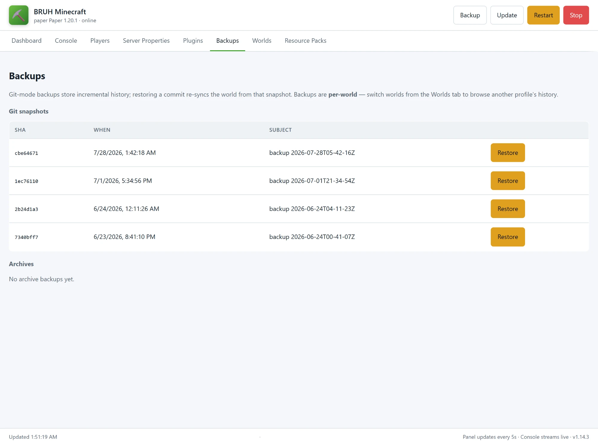
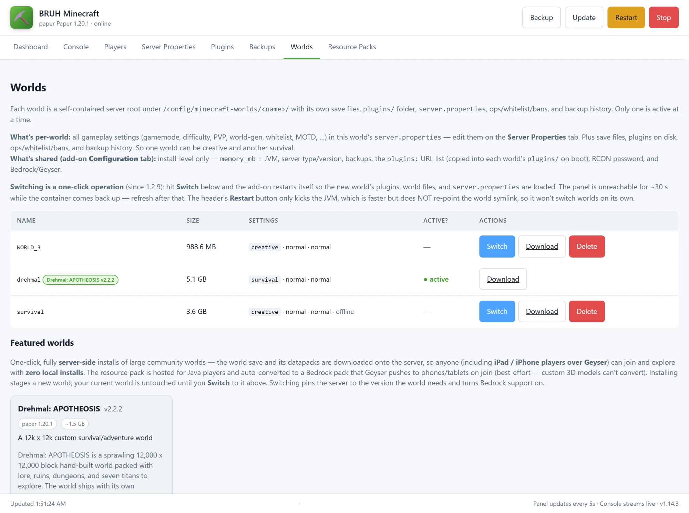

Everything you might need to look up. Configure from **Settings → Add-ons → BRUH Minecraft Server → Configuration**.

## Configuration options

### Required

| Option | Default | What it does |
|--------|---------|--------------|
| `eula` | `false` | **Set to `true` to start.** Accepts the Minecraft EULA. |

### Server type & version

| Option | Default | What it does |
|--------|---------|--------------|
| `server_type` | `paper` | `paper`, `purpur`, `folia`, `vanilla`, `fabric`, or `forge`. Paper recommended. |
| `minecraft_version` | `LATEST` | `LATEST`, `SNAPSHOT`, or pinned (`1.21.3`). |
| `auto_update_server` | `true` | Re-resolve the jar on every boot. Disable to pin. |
| `active_world` | `default` | Which saved profile is live. See [Multi-world](#multi-world-profiles). |

### Gameplay — per world, not add-on options

Since add-on **1.8.0**, gameplay settings are **not** global add-on options. Each world owns its own `server.properties` — gamemode, force-gamemode, difficulty, PVP, hardcore, whitelist, max players, view/sim distance, world-gen (level name/seed/type, structures, mobs, feature packs), online-mode, resource pack, command blocks, op level, connection throttle, idle timeout, MOTD, and everything else — edited from the panel's **Server Properties** tab (or set up front by the new-world wizard). Settings are seeded with sensible defaults the first time a world boots, then they're yours forever; switching worlds loads each world's own settings.

- **OP a player:** join once, then click **op** next to their name on the panel's **Players** tab. Ops persist per-world in `ops.json`.
- **Offline / LAN mode:** set a world's `online-mode: false` in **Server Properties** — the add-on silently forces `enforce-secure-profile: false`, switches Geyser to offline auth, uninstalls Floodgate, and disables Bedrock login validation. See [Family mode](/bruh-minecraft/quickstart/#family-mode-no-xbox-required).
- **Command blocks / op level:** `enable-command-block` and `op-permission-level` are ordinary per-world properties on the same tab.
- **Experiments:** Mojang gates experimental content behind named *feature packs* — add them to `initial-enabled-packs` (comma-separated, keep `vanilla`; recent 1.21.x examples: `minecart_improvements`, `redstone_experiments`, `trade_rebalance`). Experiments are baked in at world **creation**, so this only affects newly generated worlds — create a fresh world from the **Worlds** tab with the pack enabled.

### Performance

| Option | Default | Notes |
|--------|---------|-------|
| `memory_mb` | `2048` | 512–65536. Sized as both `-Xms` and `-Xmx`. |
| `use_aikar_flags` | `true` | Recommended G1GC tuning. |
| `extra_jvm_args` | `""` | Append your own JVM flags. |

**Sizing guide:** 4 players = 2048, 10 players + plugins = 4096, 20+ heavy = 6144–8192.

### Backups & uptime



| Option | Default | Notes |
|--------|---------|-------|
| `auto_backup` | `true` | Snapshot the world on a schedule. |
| `backup_interval_minutes` | `60` | 5–1440 |
| `backup_keep_count` | `48` | 1–500. Older snapshots pruned. |
| `backup_use_git` | `true` | `true` = git repo with deltas, `false` = tar.gz archives. |
| `auto_restart_on_crash` | `true` | 5/5min rate limit. |
| `auto_restart_schedule` | `""` | Cron format, e.g. `"0 4 * * *"` for daily 4 AM. For a scheduled restart today, use an HA automation on `bruh_minecraft.restart_server` — see [Automation recipes](#automation-recipes). |

### Connection handling

| Option | Default | Notes |
|--------|---------|-------|
| `auto_kick_ghost_sessions` | `true` | Kicks stale "already connected" sessions over RCON. |

Connection throttle and player idle timeout are per-world `server.properties` keys — edit them on the panel's **Server Properties** tab.

### Bedrock cross-play

| Option | Default | Notes |
|--------|---------|-------|
| `enable_bedrock_support` | `true` | Auto-installs Geyser + Floodgate. |
| `geyser_auth_type` | `auto` | `auto` resolves to `offline` when the active world's `online-mode` is off, else `floodgate`. Also accepts `online` and `offline` directly. |
| `geyser_mtu` | `1400` | 576–1492. Drop to `1200` if iOS hangs on "Connecting…". |

### Plugins

Two ways to install plugins, mix and match freely.

#### One-click popular plugins (1.4.0+)

Tick a checkbox in the **Configuration** tab and the add-on resolves a Paper-compatible jar via the [Modrinth](https://modrinth.com) API on every boot. Bukkit-API only — Paper / Purpur / Folia. Since **1.14.4** resolution is version-aware: the add-on picks the newest build **for your server's Minecraft version** (preferring release builds over alpha/beta), and if a plugin has no build for your version it's skipped with a clear warning rather than installing a jar Paper refuses to load.

Two of the twelve ship **on by default** — `install_viaversion` and `install_viabackwards` — so clients a version ahead of or behind the server can still join. Dependencies auto-enable: ticking `install_essentialsx_chat` pulls in `install_essentialsx`, and `install_viabackwards` pulls in `install_viaversion`.

| Checkbox | Plugin | What it does |
|----------|--------|--------------|
| `install_essentialsx` | EssentialsX | Homes, warps, kits, `/tpa`, `/repair`, basics |
| `install_essentialsx_chat` | EssentialsXChat | Chat formatting (companion to EssentialsX) |
| `install_luckperms` | LuckPerms | Modern permissions plugin |
| `install_worldedit` | WorldEdit | In-game block editing |
| `install_coreprotect` | CoreProtect | Anti-grief logging + rollback |
| `install_griefprevention` | GriefPrevention | Golden-shovel claim protection |
| `install_viaversion` | ViaVersion | Newer clients can join an older server |
| `install_viabackwards` | ViaBackwards | Older clients can join a newer server |
| `install_mcmmo` | mcMMO | RPG-style skills (Mining/Woodcutting/Swords) |
| `install_chestsort` | ChestSort | Left-click outside chest = instantly sorted |
| `install_veinminer` | VeinMiner | Break one ore → whole vein breaks |
| `install_spark` | Spark | Server profiler |

Toggling a checkbox **off** does NOT remove the jar — delete it from the panel's **Plugins** tab to remove.

Two kinds of jar are auto-quarantined to `plugins/.quarantine/` on boot: duplicates (which make Paper log "Ambiguous plugin name" and randomly disable one copy) and, since **1.14.4**, jars built for a **newer Minecraft than the server runs** — they can never load, and the quarantine manifest says to install a build for your version instead of Paper printing a stack trace every start. Both are controlled by `auto_quarantine_duplicates` (default `true`); jars are moved, never deleted — restore one by moving it back.

#### Custom URL list

For anything not in the curated set:

```yaml
plugins:
  - url: https://example.com/Essentials.jar
    name: Essentials.jar          # optional rename
  - "https://example.com/ViaVersion.jar"   # plain URL also works
```

Loaded for `paper` / `purpur` / `folia`. Bad URLs are skipped with a warning, never block startup. Downloads use `If-Modified-Since` so unchanged jars don't re-fetch.

:::tip
GitHub `releases/latest/download/X.jar` URLs only resolve when the asset is named *exactly* `X.jar`. Versioned filenames like `NickNamer-5.15.0.jar` need a pinned URL.
:::

#### Where to browse for more plugins

| Marketplace | Notes |
|-------------|-------|
| [Modrinth](https://modrinth.com/plugins) | The cleanest source for direct download URLs. Used by the one-click checkboxes. |
| [Hangar](https://hangar.papermc.io) | PaperMC's official marketplace. ViaVersion, ViaBackwards, ViaRewind, ProtocolLib, PlaceholderAPI live here. |
| [SpigotMC](https://www.spigotmc.org/resources/categories/spigot.4/) | The original Bukkit-plugin marketplace. Some plugins are still SpigotMC-only. |
| [BukkitDev](https://dev.bukkit.org/bukkit-plugins) | Older but still hosts a few classics. |

### Other

| Option | Default | Notes |
|--------|---------|-------|
| `rcon_password` | auto-generated | Loopback-only at `127.0.0.1:25575`. You almost never need to set this. |
| `enable_ha_integration` | `true` | Deploys the `bruh_minecraft` integration and starts the IPC bridge. |
| `announce_ha_events` | `true` | Announce HA-triggered events in chat with `/say`. |
| `log_level` | `info` | `trace`–`fatal`. |

## Ports

| Port | What | Needed? |
|------|------|---------|
| 25565/tcp + udp | Minecraft Java Edition. | Yes, for anyone joining from Java. |
| 19132/udp | Minecraft Bedrock, via Geyser. | Only with `enable_geyser` on — phones, consoles and Windows Bedrock discover the server through it. |
| 24454/udp | Simple Voice Chat. | Only with the voice-chat plugin installed. |

The add-on runs with host networking (Bedrock LAN discovery needs it), so these answer on the host's own address. The management panel itself is ingress-only — it rides Home Assistant's login, and its API refuses anything from the LAN that isn't the Supervisor or loopback.

## Recommended presets

Add-on options set the container; gameplay is set per world in the panel's **Server Properties** tab (noted below each preset).

### Family LAN (no Xbox accounts)

```yaml
eula: true
memory_mb: 4096
auto_backup: true
backup_interval_minutes: 30
```

Then in **Server Properties** for the family world: `online-mode=false`, `difficulty=easy` — and op the parents from the **Players** tab.

### Public survival

```yaml
eula: true
memory_mb: 6144
auto_backup: true
backup_keep_count: 96
```

Then in **Server Properties**: `online-mode=true`, `white-list=true`, `difficulty=hard`, `prevent-proxy-connections=true`. Add a nightly-restart automation on `bruh_minecraft.restart_server` for long uptimes.

### Performance / plugin-heavy

```yaml
eula: true
server_type: paper
memory_mb: 8192
```

Then in **Server Properties**: `view-distance=8`, `simulation-distance=6`, `network-compression-threshold=512`.

## What's set where

Since 1.8.0 the split is simple:

1. **Add-on Configuration tab = install/container level.** EULA, active world, server type/version, RAM + JVM flags, RCON password, auto-update, backups, crash-restart, HA integration, Bedrock/Geyser, plugin toggles + URL list, log level.
2. **Panel → Server Properties tab = gameplay, per world.** Each world's `server.properties` is seeded with sensible defaults on first boot, then owned by you — edits persist across restarts and travel with the world.
3. **Panel ops/whitelist/bans persist per world.** They live in each world's `ops.json` / `whitelist.json` / `banned-players.json`.
4. **`plugins:` URLs and `install_*` toggles re-resolve on every boot** into the **active** world's `plugins/` folder. Deleting a jar from the panel is temporary if its URL/toggle is still set.

## Multi-world profiles

Each profile is a full server root at `/config/minecraft-worlds/<name>/` with its own world, `server.properties`, plugins, and backups. Only one is active at a time.

**Switch:** Panel → **Worlds tab → Switch**. Writes `active_world`, full restart, ~30 s.

**Per-profile:** world files, `server.properties`, plugins folder, ops/whitelist/bans, backup history.
**Shared across profiles:** the add-on's install/container options (server type, memory_mb, backups, Bedrock/Geyser, the `plugins:` URL list + toggles), RCON password. Gameplay settings — difficulty, gamemode, MOTD, and the rest of `server.properties` — are per-world.

**Import (1.10.0+):** the Worlds tab accepts a Minecraft world `.zip` up to 2 GB. The add-on finds the directory containing `level.dat` wherever it sits in the zip and stages it as a new switchable profile — then *Switch* into it.

### Featured worlds (1.14.0+)



The Worlds tab has a **Featured worlds** section: curated community worlds installed with one click, hosted entirely **server-side** so players — including iPads and iPhones on Bedrock via Geyser — just join, with zero local installs. **Install** downloads the world and its bundled datapacks as a new switchable profile (your current world is untouched), writes its `server.properties` from the catalog recipe, and converts its resource pack to a Bedrock pack Geyser pushes on join. **Switch** then pins the server to the software + Minecraft version the world requires and restarts — switching back to your own world may need you to re-pick a version on the Configuration tab.

The headline entry is [Drehmal: APOTHEOSIS](https://www.drehmal.net), a hand-built 12k × 12k adventure world (~1.5 GB download, Minecraft 1.20.1 on Paper). Bedrock players can explore the whole map; vanilla retextures come across in the auto-converted pack, but custom 3D models and animated textures don't — a Bedrock platform limit, and Drehmal's optional client-side Fabric mods aren't required to play.

## Offline mode

Since 1.3.0, the server starts even when the HA host has no internet — provided it's been online at least once to cache the jars.

**How it's detected:** at boot, the add-on hits `https://api.papermc.io/v2/` with a 5-second timeout. Reachable = online; otherwise the add-on logs a banner and runs in offline mode for the rest of the session.

**What gets skipped when offline:**

- Server-jar resolution / re-download — the existing `server.jar` is reused as-is.
- Plugin URL fetches in the `plugins:` list — whatever's already in `plugins/` keeps loading.
- Geyser / Floodgate auto-updates — cached jars are reused.

**What still happens offline:**

- `server.properties` is checked as usual — infrastructure keys (RCON, query, ports) are enforced, your gameplay edits are preserved.
- Geyser config (auth-type, MTU, MOTD) is patched on every boot — those edits don't need network.
- Ops / whitelist / bans, world / backup / panel / RCON, all HA integration plumbing — fully functional.

**First-ever boot still needs internet** (there's nothing cached to fall back to). The add-on will log a clear actionable error if you try to start offline with no cached jar:

```
[download-server] ERROR: offline mode and no cached server.jar exists
[download-server]   Connect to the internet once so the initial jar can be downloaded;
[download-server]   subsequent boots will continue to work offline.
```

There's no config option for this — the behaviour kicks in automatically based on network reachability.

## Panel tabs

| Tab | What it does |
|-----|--------------|
| **Dashboard** | Status, uptime, memory, TPS, online players, quick `/say`, one-shot RCON. |
| **Console** | Live colour-coded JVM log via SSE; command input runs over RCON. |
| **Players** | Op / kick / ban / whitelist with one click. |
| **Server Properties** | Per-world editor — your edits persist and travel with the world (see [What's set where](#whats-set-where)). |
| **Plugins** | Install by URL, list with size/mtime, delete. |
| **Backups** | Git snapshots and archives, one-click restore. Scoped to active profile. |
| **Worlds** | List, switch, create, import (`.zip`, up to 2 GB), delete profiles — plus **Featured worlds**, curated community worlds installed with one click (see below). |
| **Resource Packs** | Upload a pack `.zip` (≤ 250 MB); the add-on stores it under `/config/resource-packs/`, serves it on the LAN, and **Apply to active world** writes the URL + SHA-1 into that world's `server.properties`. |

Header buttons (always visible): **Backup** • **Update** • **Restart** (JVM-only, ~15 s) • **Stop** (sets `no_restart`).

## Home Assistant entities

### Sensors

| Sensor | Notes |
|--------|-------|
| `players_online` | `players` list in attributes |
| `players_max` | |
| `tps_1m` / `tps_5m` / `tps_15m` | Paper / Purpur / Folia only |
| `latency_ms` / `uptime` | |
| `version` / `server_type` / `motd` / `difficulty` / `gamemode` | |

### Binary sensors

`reachable` (status ping ok), `rcon_ok` (disabled by default).

### Buttons

`backup_now`, `restart_server`, `stop_server`, `save_all`.

## Services

```yaml
# Broadcast to chat
service: bruh_minecraft.say
data: { message: "Dinner's ready — server going down in 2 min" }

# Any RCON command
service: bruh_minecraft.rcon_command
data: { command: "weather clear" }

# Give an item to an online player
service: bruh_minecraft.give
data: { player: "Alice", item: "minecraft:diamond_pickaxe", amount: 1 }

# Lifecycle
service: bruh_minecraft.backup_now
service: bruh_minecraft.restart_server
service: bruh_minecraft.stop_server

# Quality-of-life
service: bruh_minecraft.set_weather    # data: { weather: clear|rain|thunder }
service: bruh_minecraft.set_time       # data: { time: day|night|noon|midnight|"12000" }

# Player management — all take player: "<name>"
service: bruh_minecraft.op_player
service: bruh_minecraft.deop_player
service: bruh_minecraft.kick_player
service: bruh_minecraft.ban_player
service: bruh_minecraft.whitelist_add
service: bruh_minecraft.whitelist_remove

# Notify platform — broadcast as a notify target
service: notify.bruh_minecraft_broadcast
data: { message: "Doorbell rang!" }
```

## Automation recipes

```yaml
# Nightly backup at 4 AM
automation:
  - trigger: { platform: time, at: "04:00:00" }
    action: { service: bruh_minecraft.backup_now }

# Nightly restart at 4:30 AM (helps long-uptime memory creep)
automation:
  - trigger: { platform: time, at: "04:30:00" }
    action: { service: bruh_minecraft.restart_server }

# Auto-stop when idle for 30 minutes
automation:
  - trigger:
      platform: numeric_state
      entity_id: sensor.bruh_minecraft_players_online
      below: 1
      for: "00:30:00"
    action: { service: bruh_minecraft.stop_server }

# Bedtime kick
automation:
  - trigger:
      platform: numeric_state
      entity_id: sensor.bruh_minecraft_players_online
      above: 0
    condition: { condition: time, after: "22:30:00", before: "06:00:00" }
    action:
      - service: bruh_minecraft.say
        data: { message: "Server going to sleep in 60s — save your work!" }
      - delay: "00:01:00"
      - service: bruh_minecraft.stop_server
```

## Security (1.15.0+)

The add-on rates **6/6** in the add-on store:

- **The management panel only answers requests that arrive through Home Assistant.** The add-on runs with host networking (Bedrock LAN discovery needs it), which puts the panel's port on your network — so since 1.15.0 it refuses any connection that isn't from the Supervisor or loopback, judged by the connection's own peer address. Opening `http://<HA-host>:8099` directly gets nothing, by design; refusals are logged. Two paths stay public because they must be: `/pack/<name>` (Minecraft clients fetch resource packs from it) and `/api/health` (liveness only).
- **AppArmor is on.** The profile lets the JVM do JVM things and denies the host-escape set — it matters here because plugin jars run with the server's full authority.
- **A watchdog** polls `/api/health` and restarts a hung panel.
- **The generated RCON password and console log are excluded from HA backups.** Your worlds and world backups still go in — those are the point of backing this add-on up.

## Where data lives

| Path | Contents |
|------|----------|
| `/config/minecraft/` | Symlink to the active profile |
| `/config/minecraft-worlds/<profile>/` | Full server root per profile |
| `/config/minecraft-backups/<profile>/` | Git snapshots or tar.gz archives |
| `/config/resource-packs/` | Uploaded resource packs, served to players from the panel |
| `/config/.bruh_minecraft/` | HA bridge — request/response queues, stats |
| `/config/custom_components/bruh_minecraft/` | Companion integration |
| `/data/server-cache/` | Cached jars (content-addressed) |
| `/data/panel/` | Panel state, RCON secret, console log |

## Troubleshooting

### Won't start

| Symptom | Fix |
|---------|-----|
| `EULA has NOT been accepted` | `eula: true`. |
| `address already in use: 25565` | Stop the conflicting process or remap the port. |
| Plugin install warning then continues | Bad URL — fix or remove from `plugins:`. |
| One-click plugin didn't appear | No Modrinth build exists for your server's Minecraft version — the log says which plugin was skipped and why. |

### Connection issues

| Symptom | Fix |
|---------|-----|
| Can't connect from internet | Forward `25565/tcp` + `25565/udp` (and `19132/udp` for Bedrock) to HA host. Never forward `8099` — the panel refuses direct callers anyway. |
| Panel does nothing when opened by IP (`<HA-host>:8099`) | By design since 1.15.0 — the panel only answers through Home Assistant. Open it from the sidebar; refusals show in the add-on log. |
| "Please log into Xbox" | Set the world's `online-mode=false` (panel → **Server Properties**). |
| iOS hangs on "Connecting…" | `geyser_mtu: 1200`. |
| "You are already connected" | Auto-kicker should clear it; manual kick from Players tab. |
| Bedrock not in Friends tab | Same subnet/VLAN as HA host? Try manual `<HA IPv4>:19132`. |

### Performance

| Symptom | Fix |
|---------|-----|
| TPS sensors null | TPS only reported by Paper / Purpur / Folia. |
| OOM crashes | Bump `memory_mb`. |
| Sagging TPS | Lower `view_distance` (8) and `simulation_distance` (6). A nightly-restart automation on `bruh_minecraft.restart_server` helps with memory creep. |

### Diagnostics

Bump `log_level: debug` and reproduce. Check the **Log** tab for boot/supervisor errors and the panel's **Console** tab for live JVM output. Full historical JVM log: `/data/panel/console.log`.

File issues at <https://github.com/bruhautomation/BRUH-HA-Apps/issues>.
